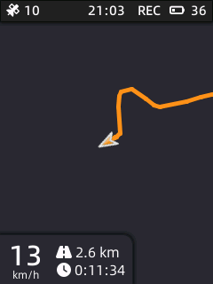
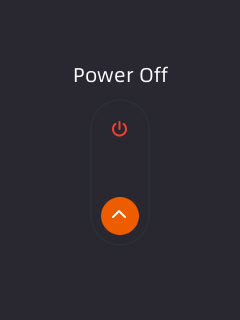

# Bicycle Track example

\[ English | [简体中文](X_Track_zh-cn.md) \]

## Introduction

`X-TRACK Demo` is ported from the open source project [X-TRACK](https://github.com/FASTSHIFT/X-TRACK). Thanks to FASTSHIFT, the original author of X-TRACK, for completing the porting.

It is a bicycle computer with functions such as speed display, distance statistics and real-time track display. The display resolution is 240x320 and it uses touch screen interaction.

The code directory is located at: `apps/packages/demos/x_track`

This article describes how to run the example on openvela Emulator.

## Prerequisites

1. Build the development environment, see [Environment Build](../Getting_Started/Set_up_the_development_environment.md).

2. Download the source code, see [Download openvela source code](../Getting_Started/Download_Vela_sources.md).

## Step 1 Configuration Project

1. Switch to the root directory of the openvela repository and run the following command to open the compilation configuration project:

    ```Bash
    ./build.sh vendor/openvela/boards/vela/configs/goldfish-armeabi-v7a-ap menuconfig
    ```

2. Modify the following configurations one by one.

    ```Bash
    LIB_PNG = y
    LV_USE_LIBPNG = y
    NETUTILS_CJSON = y
    UIKIT = y
    UIKIT_FONT_MANAGER = y
    LVX_USE_DEMO_X_TRACK = y
    ```

    > Take enabling the `LIB_PNG` configuration as an example, and other configuration operations are the same.

    1. Press the `/` key on the keyboard to enter the search mode, enter `LIB_PNG` in the search bar, use the arrow keys to move the cursor to `LIB_PNG`, and press Enter to confirm.

        

    2. Press the spacebar on the Enable libpng option to turn it on. The `*` in `[ ]` indicates that the configuration is turned on.

        

    3. The methods for turning on the remaining configuration items are the same as above.

## Step 2 Start compiling

1. Run the following command to start compiling:

    - -j16: Indicates using 16 threads to compile the code in parallel to speed up the compilation.

    ```Bash
    # Clean up build products
    ./build.sh vendor/openvela/boards/vela/configs/goldfish-armeabi-v7a-ap distclean -j16

    # Start building
    ./build.sh vendor/openvela/boards/vela/configs/goldfish-armeabi-v7a-ap -j16
    ```

2. After successful compilation, the following files will be generated in the `nuttx` directory.
    
    ```Bash
    ./nuttx
    ├── vela_ap.elf
    ├── vela_ap.bin
    ```

## Step 3 Start the emulator and push resources

1. Switch to the root directory of the openvela repository and start the emulator:

    ```Bash
    ./emulator.sh vela
    ```

2. Use `ADB` supported by the emulator to push resources to the device. Open a new terminal in the root directory of the openvela repository and enter `adb push` followed by the file path to transfer the resources to the corresponding location.

    ```Bash
    # Install adb
    sudo apt install android-tools-adb

    # Push resources
    adb push apps/packages/demos/x_track/resource/font /data
    adb push apps/packages/demos/x_track/resource/images /data
    adb push apps/packages/demos/x_track/resource/track /data
    ```

## Step 4 Startup

### 1 Boot page

1. Enable the `X-TRACK` program and enter the following command in the simulator environment:

    ```Bash
    x_track language en-US &
    ```

2. The effect after execution is as shown below:

    

### 2 Main interface


The three function buttons below correspond to different function pages:

1. Motion track page

    The lower left corner of this page shows the basic information of the current movement, and the middle part shows the current movement direction and the track. Swipe right to return to the previous page.

    

2. Power off page

    This page imitates the power off page of a mobile phone. Press and hold the yellow scroll bar and drag it up to the bottom and then release it to turn off the phone. Click other positions or swipe right to return to the previous page.

    

3. System information page

    This page shows more detailed system information. Swipe up and down or click the corresponding icon to switch different information displays. Swipe right to return to the previous page.

    

## FAQ

| Problem | Reason | Solution |
| -------------------------------------- | ------------------------------------------------------------ | ------------------------------------------------------------ |
| adb command not found | adb tool not installed | Enter command to install: `sudo apt install android-tools-adb` |
| Fonts are displayed as boxes (garbled characters) | Font resources are not loaded correctly | According to **Step 3 Start the emulator and push resources** above, push resources again. |
| Why is there no map display function? | There are copyright issues with commercial map resources, so the map function cannot be provided. Only the track display function is retained. | - |
| Why is the UI different from the original version? | This Demo has been **substantially adjusted** based on the original code, so the functions and displays are slightly different. | - |
| Why is the battery level in the upper right corner of the status bar jumping randomly? | The simulator uses a simple random number to simulate the battery level, so this is normal. | - |
| Is this track simulated? | Yes, it reads the [GPX](https://zh.wikipedia.org/wiki/GPX) file to replay the track and simulate GNSS to generate data. | - |
| How to replace and display your own track file? | - | Rename your own track file (GPX format) to `TRK_EXAMPLE.gpx` and push it to the `/data/Track` directory using the adb tool. |