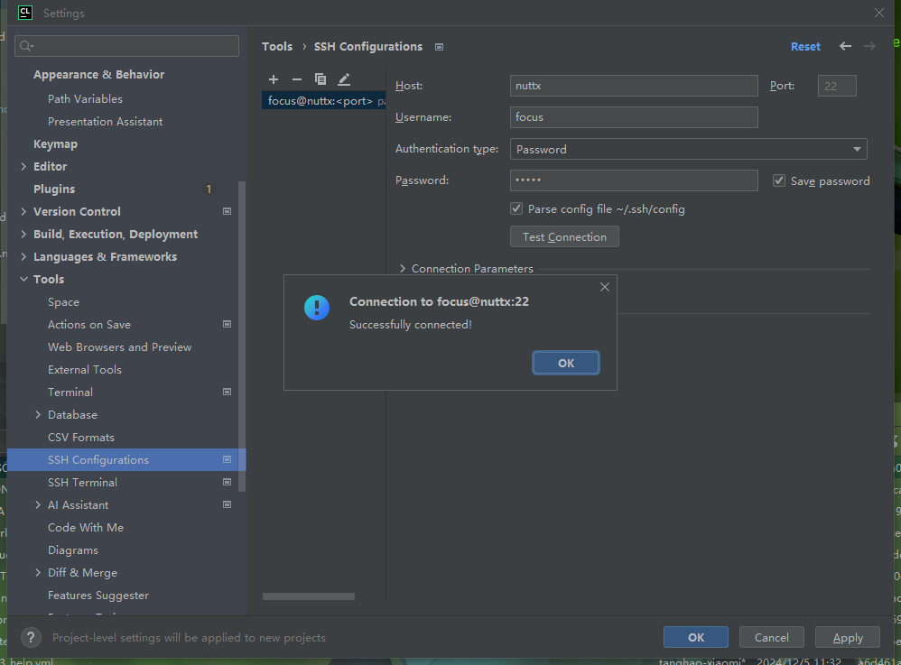
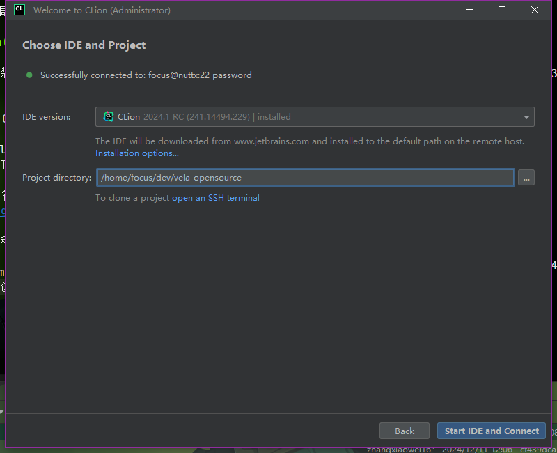
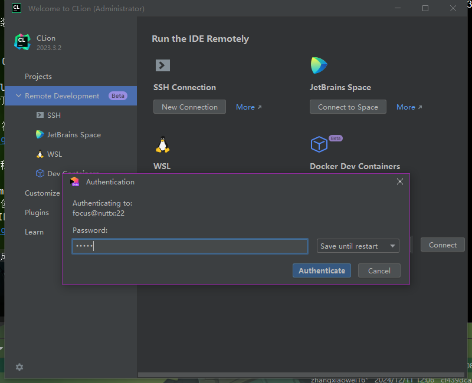
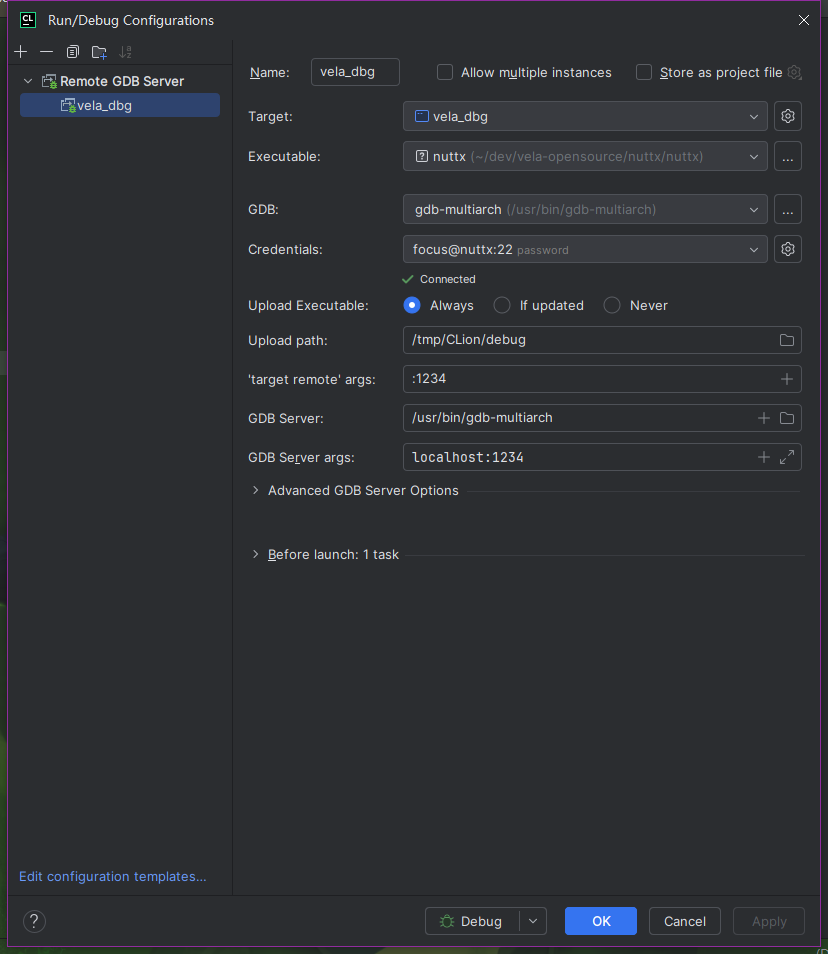

# Debugging with openvela Emulator

\[ English | [简体中文](./Debugging_Vela_with_Vela_Emulator_zh-cn.md) \]

## Use GDB Console

Use the following commands to install the required packages on Ubuntu 22.04:

```
sudo apt update
sudo apt install gdb-multiarch
```

Openvela Emulator supports working with gdb via gdb’s remote-connection facility (the “gdbstub”). This allows you to debug guest code in the same way that you might with a low-level debug facility like JTAG on real hardware. You can stop and start the virtual machine, examine state like registers and memory, and set breakpoints and watchpoints.

In order to use gdb, launch openvela Emulator with the `-s` and `-S` options. The `-s` option will make openvela Emulator listen for an incoming connection from gdb on TCP port 1234, and `-S` will make openvela Emulator not start the guest until you tell it to from gdb.

To enable connection to the GDB server, you need to pass `-qemu -S -s` parameter to `emulator.sh`.

```
./emulator.sh vela -qemu -S -s
```

Open a new Terminal, run `gdb-multiarch`:

```
gdb-multiarch nuttx/nuttx
```

```
GNU gdb (Ubuntu 12.1-0ubuntu1~22.04.2) 12.1
Copyright (C) 2022 Free Software Foundation, Inc.
License GPLv3+: GNU GPL version 3 or later <http://gnu.org/licenses/gpl.html>
This is free software: you are free to change and redistribute it.
There is NO WARRANTY, to the extent permitted by law.
Type "show copying" and "show warranty" for details.
This GDB was configured as "x86_64-linux-gnu".
Type "show configuration" for configuration details.
For bug reporting instructions, please see:
<https://www.gnu.org/software/gdb/bugs/>.
Find the GDB manual and other documentation resources online at:
    <http://www.gnu.org/software/gdb/documentation/>.

For help, type "help".
Type "apropos word" to search for commands related to "word"...
Reading symbols from nuttx/nuttx...
```

To connect to openvela Emulator's GDB server using your host GDB, you need to create a remote connection.

Once you are connected, you can debug your emulated environment like you would debug any other program.

```
(gdb) target remote localhost:1234
```

```
Remote debugging using localhost:1234
__start () at armv7-a/arm_head.S:207
207		cpsid		if, #PSR_MODE_SYS
```

To set a breakpoint:

```
(gdb) b nx_start
```

```
Breakpoint 1 at 0x601cdc: file init/nx_start.c, line 317.
```

To Continues execution:

```
(gdb) c
```

```
Continuing.

Breakpoint 1, nx_start () at init/nx_start.c:317
317	{
```

To display source code:

```
(gdb) l
```

```
312	 *   Does not return.
313	 *
314	 ****************************************************************************/
315	
316	void nx_start(void)
317	{
318	  int i;
319	
320	  sinfo("Entry\n");
321
```

Display information on all breakpoints in your GDB session:

```
(gdb) info break
```

```
Num     Type           Disp Enb Address    What
1       breakpoint     keep y   0x00601cdc in nx_start at init/nx_start.c:317
	breakpoint already hit 1 time
```

Enable or Disable breakpoint:

```
disable <breakpoint-number>
enable <breakpoint-number>
```

Delete breakpoint:

```
d <breakpoint-number>
```

Quits GDB:

```
(gdb) q
```

## Use Visual Studio Code

1. Install Visual Studio Code from https://code.visualstudio.com/ .

2. Install Visual Studio Code Extension.

    ```
    code --install-extension ms-vscode.cpptools-extension-pack
    ```

3. Open openvela workspace

    You can open vela workspace by using the `File` > `Open Folder`... menu, and then selecting vela folder.

    Alternatively, if you launch VS Code from a terminal, you can pass the vela source path to a folder as the first argument to the code command for opening.

    For example, use the following command to open the current folder (.) with VS Code:

    ```
    code .
    ```

4. Add Launch configurations

    To run or debug vela source in VS Code, select `Run and Debug` on the Debug start view or press `F5` and VS Code will try to run your currently active file.

    However, for most debugging scenarios, creating a launch configuration file is beneficial because it allows you to configure and save debugging setup details. VS Code keeps debugging configuration information in a launch.json file located in a .vscode folder in your workspace (project root folder) or in your user settings or workspace settings.

    To create a `launch.json` file, select `create a launch.json file` in the Run start view.

    Here is the launch configuration for openvela debugging:

    ```
    {
        // Use IntelliSense to learn about possible attributes.
        // Hover to view descriptions of existing attributes.
        // For more information, visit: https://go.microsoft.com/fwlink/?linkid=830387
        "version": "0.2.0",
        "configurations": [
            {
                "name": "Debug openvela",
                "type": "cppdbg",
                "request": "launch",
                "program": "${workspaceFolder}/nuttx/nuttx",
                "cwd": "${workspaceFolder}",
                "MIMode": "gdb",
                "miDebuggerPath": "/usr/bin/gdb-multiarch",
                "miDebuggerServerAddress": "localhost:1234"
            }
        ]
    }
    ```

    If you go back to the File Explorer view (Ctrl+Shift+E), you'll see that VS Code has created a `.vscode` folder and added the `launch.json` file to your workspace.

5. Launch openvela Emulator with the `-s` and `-S` options to use gdb.

    ```
    ./emulator.sh vela -qemu -S -s
    ```

6. Start a debug session.

    In order to start a debug session, first select the configuration named Launch Program using the Configuration dropdown in the Run and Debug view. select `Debug openvela`, start your debug session with F5.

## Use Clion(Remote Debug)

1. download clion from here (recommend newer version) https://www.jetbrains.com/clion/

2. Config SSH Configurations

   click `Customize | All Settings` to menu from Welcome page
   (if you already open a project click `File | Close Project` back to welcome page)

   click the `+` button and fill the ssh info (then check) like this
   

3. Config and Choose Remote Project

   On Welcome page select `Remote Development | SSH | New Project`
   select the ssh connection we config before and click the button `Check Connection and Continute`
   choose ide then select the project when we clone before
   then click `Start IDE and Connect`
   
   

   wait for download finish and `Authenticate` like this
   

4. Create Debug Configuration

   click `Add Configuration | Remote GDB Server` and config like this
   

   Target can be created with default(just a target)
   

5. Launch openvela Emulator with the `-s` and `-S` options to use gdb.

    ```
    ./emulator.sh vela -qemu -S -s
    ```

6. Start a debug session.

   click debug icon then we can debug
   

   (you would get the confirmation when you do the first debug)
   
   