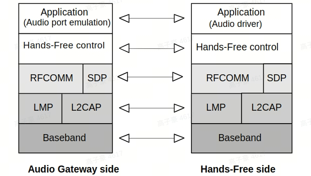

# 通话问题

本章介绍Hands-Free Profile（HFP）相关问题常用的分析、定位方法。

HFP是蓝牙通话协议，包含Audio Gateway（AG）和Hands-Free unit （HF）两个角色。通常，AG是音频网关，负责音频设备输入输出，典型设备为手机，HF作为音频网关的远程音频输入/输出设备，典型设备为耳机。HFP协议栈的层级结构如下图所示



<a id="方法：观察是否建立了HFP连接"></a>

## 一、观察是否建立了HFP连接

在HFP协议中，两个蓝牙设备间的连接包含多个层面。一般来说，Service Level Connection（SLC）的建立标志着HFP连接已经完成。通常，可以通过syslog，snoop log，或者air log观察是否建立了HFP连接。

### 1、通过syslog观察是否建立了HFP连接

典型log如下：

* HFP HF 连接对端设备（HFP AG）成功
```
[hf_stm]: Enter State=Connected, Peer=[AA:AA:AA:AA:AA:AA]
```
* HFP AG 连接对端设备（HFP HF）成功
```
[ag_stm]: Enter State=Connected, Peer=[AA:AA:AA:AA:AA:AA]
```

### 2、通过snoop log观察是否建立了HFP连接，以及观察可能的失败原因

在建立SLC连接的过程中，AG和HF设备需要在RFCOMM信道上交互多组AT命令，具体流程可参考下图。其中，实线箭头指代的命令为流程，虚线箭头指代的命令为可选流程。Standard Event Reporting Activation（AT+CMER）是必要流程中的最后一组命令，通常标志着SLC建立完成。


两个蓝牙设备建立HFP连接的典型log如下：


<a id="方法：观察设备是否支持HFP"></a>

## 二、观察设备是否支持HFP

当两个设备均未能发起HFP连接时，建议观察双方设备是否支持HFP。通常，可以通过syslog，snoop log，或者air log观察设备是否支持HFP。

### 1、通过syslog观察设备是否支持HFP

典型log如下：

* HFP HF 服务注册成功
```
[service_manager]: HFP-HF service register success
```
* HFP HF 服务开启成功
```
[service_manager]: service_on_startup {HFP-HF} start ret:1
```
* HFP AG 服务注册成功
```
[service_manager]: HFP-AG service register success
```
* HFP AG 服务开启成功
```
[service_manager]: service_on_startup {HFP-AG} start ret:1
```

### 2 通过snoop log或air log观察双方设备是否支持HFP

典型log如下：

* SDP中，声明支持HFP-HF角色


* SDP中，声明支持HFP-AG角色


<a id="方法：观察是否建立了SCO连接"></a>

## 三、观察是否建立了SCO连接

两台设备之间传输通话语音需要建立SCO连接。通常，可以通过syslog，snoop log，或者air log观察SCO是否建立成功。

### 1、通过syslog观察是否建立了SCO连接

* 本地设备为HF，成功建立了SCO连接
```
[hf_stm]: Enter State=AudioOn, Peer=[AA:AA:AA:AA:AA:AA]
```
* 本地设备为AG，成功建立了SCO连接
```
[ag_stm]: Enter State=AudioOn, Peer=[AA:AA:AA:AA:AA:AA]
```
<a id="方法：观察是否向Media设置了SCO音频参数"></a>

## 四、观察是否向Media设置了SCO音频参数

AG和HF都需要在SCO建立完成之后向Media设置SCO音频参数，包含Codec采样率和设备结点可用的信息，典型log如下：
```
[Media_proxy_once:430] policy:audio:0x20556fd4 HFPSampleRate set_int 16000 _ ret:0 resp:0
[Media_proxy_once:430] policy:audio:0x20556fec AvailableDevices include sco apply ret:0 resp:0
```

<a id="方法：观察HF是否向AG发送了Answer请求"></a>

## 五、观察HF是否向AG发送了Answer请求

当HF请求AG接听来电时，HF端需要发起Answer请求。具体的，HF会向AG发送ATA命令。通常，可以通过syslog，snoop log，或者air log观察AG是否收到了HF的Answer请求。

### 1、通过syslog观察HF是否向AG发送了Answer请求

在AG端，Vela蓝牙服务有两个途径处理来自HF端的ATA命令，包括：

* 通过Bluetooth Framework向上层应用发送callback，典型log包括：

```
[hfp_ag]: ag_service_notify_call_answered
```

* 通过Telephony模块直接接听电话

```
> RIL_REQUEST_ANSWER
```

在HF端，Vela蓝牙服务可以根据应用请求发送ATA命令，典型log包括：

```
[hf_stm]: Accept incoming call
```

### 2、通过snoop log观察HF是否向AG发送了Answer请求


<a id="方法：观察AG是否向HF发送了来电信息"></a>

## 六、观察AG是否向HF发送了来电信息

AG端收到来电时，需要向HF端发送+CIEV和RING指令，AG端还需要在+CLCC中描述来电详细信息，通常，可以通过syslog，snoop log，或者air log观察AG是否向HF发送了来电信息。

### 1、通过syslog观察AG是否向HF发送了来电信息

```
[hf_stm]: ProcessEvent, State=Connected, Peer=[AA:AA:AA:AA:AA:AA], Event=HF_STACK_EVENT_CALLSETUP
[hf_stm]: ProcessEvent, State=Connected, Peer=[AA:AA:AA:AA:AA:AA], Event=HF_STACK_EVENT_RING_INDICATION
[hf_stm]: ProcessEvent, State=Connected, Peer=[AA:AA:AA:AA:AA:AA], Event=HF_STACK_EVENT_CURRENT_CALLS
```

<a id="方法：观察HF端是否通知了应用AG端有来电"></a>

## 七、观察HF端是否通知了应用AG端有来电

HF端收到AG端的来电通知后，需要将电话状态通知给应用，通常，可以通过syslog观察HF端是否通知了应用AG端有来电。

### 1、通过syslog观察HF端是否通知了应用AG端有来电

```
[hfp_hf]: hf_service_notify_callsetup
[hfp_hf]: hf_service_notify_call_state_changed
```

## 典型问题

<a id="问题：AG端接通电话，HF端通话无声"></a>

### 问题一：AG端接通电话，HF端通话无声

AG端接通电话，HF端通话无声的问题可能有多种原因导致，可考虑的定位方法包括：

* [观察是否建立了HFP连接](#方法：观察是否建立了HFP连接)

  * 若双方设备中，至少一方发起了连接，但连接失败，建议对比典型log，分析连接失败的原因。

  * 若双方设备均未能发起上述连接，建议[观察双方设备是否支持HFP](#方法：观察设备是否支持HFP)。

* [观察双方设备是否建立了SCO连接](#方法：观察是否建立了SCO连接)

  * 若HFP连接成功，建议观察双方设备是否建立了SCO连接，通常，应当由AG设备发起SCO连接，在AG侧，通常由App发起SCO连接。

  * 若双方均未能发起SCO连接，建议在AG端App侧检查未能发起SCO连接的原因。

  * 若发起SCO连接，但是连接失败，建议对比典型log，分析失败原因。

  * 若SCO建立成功，建议[观察是否向Media设置了SCO音频参数](#方法：观察是否向Media设置了SCO音频参数)。

* [观察是否向Media设置了SCO音频参数](#方法：观察是否向Media设置了SCO音频参数)

  * 若蓝牙成功设置了SCO音频参数，则蓝牙侧完成了音频传输的必要流程，建议在Vela Media侧观察无声的原因。

  * 若未设置SCO音频参数，建议检查蓝牙和Media子系统之间的通信是否出现了异常。


<a id="问题：HF端接通电话，HF端无声"></a>

### 问题二：HF端接通电话，HF端无声

* [观察HF是否向AG发送了Answer](#方法：观察HF是否向AG发送了Answer请求)

  * 若AG端未收到HF端的Answer请求，建议对比典型log，观察HF未能发送ATA命令，或者AG未能处理ATA命令的原因。

  * 若AG端收到了HF端的Answer请求，建议[观察双方设备是否支持HFP](#方法：观察设备是否支持HFP)。

* [观察双方设备是否建立了SCO连接](#方法：观察是否建立了SCO连接)

  * 若HFP连接成功，建议观察双方设备是否建立了SCO连接，通常，应当由AG设备发起SCO连接，在AG侧，通常由App发起SCO连接。

  * 若双方均未能发起SCO连接，建议在AG端App侧检查未能发起SCO连接的原因。

  * 若发起SCO连接，但是连接失败，建议对比典型log，分析失败原因。

  * 若SCO建立成功，建议[观察是否向Media设置了SCO音频参数](#方法：观察是否向Media设置了SCO音频参数)。

* [观察是否向Media设置了SCO音频参数](#方法：观察是否向Media设置了SCO音频参数)

  * 若蓝牙成功设置了SCO音频参数，则蓝牙侧完成了音频传输的必要流程，建议在Vela Media侧观察无声的原因。

  * 若未设置SCO音频参数，建议检查蓝牙和Media子系统之间的通信是否出现了异常。

<a id="问题：作为AG端，不能受HF端控制接听电话"></a>

### 问题三：作为AG端，不能受HF端控制接听电话

* [观察HF是否向AG发送了Answer请求](#方法：观察HF是否向AG发送了Answer请求)

  * 若AG端未收到Answer请求，建议对比典型log，观察HF未能发送ATA命令的原因。

  * 若AG端收到了HF端的Answer请求，建议在Vela Telephony侧观察未能接听电话的原因。

<a id="问题：作为HF端，AG端来电，HF端无来电显示"></a>

### 问题四：作为HF端，AG端来电，HF端无来电显示

* [观察是否建立了HFP连接](#方法：观察是否建立了HFP连接)

  * 若双方设备中，至少一方发起了连接，但连接失败，建议对比典型log，分析连接失败的原因。

  * 若双方设备均未能发起上述连接，建议[观察双方设备是否支持HFP](#方法：观察设备是否支持HFP)。

* [观察AG是否向HF发送了来电信息](#方法：观察AG是否向HF发送了来电信息)

  * 若HF端未收到AG端的来电通知，建议对比典型log，观察AG未能发送来电信息的原因。

  * 若HF端收到了AG端的来电通知，建议[观察HF端是否通知了应用AG端有来电](#方法：观察HF端是否通知了应用AG端有来电)。

* [观察HF端是否通知了应用AG端有来电](#方法：观察HF端是否通知了应用AG端有来电)

  * 若HF端未上报电话状态，建议对比典型log，观察callback失败的原因。

  * 若HF端上报了电话状态，建议在App侧观察未能正确处理来电的原因。
