# 蓝牙配对问题

- [蓝牙配对问题](#蓝牙配对问题)
  - [一、观察是否对方设备未打开可连接模式](#一观察是否对方设备未打开可连接模式)
    - [1、通过第三方设备观察是否连接成功](#1通过第三方设备观察是否连接成功)
    - [2、通过airlog观察是否Page成功](#2通过airlog观察是否page成功)
    - [3、通过协议栈syslog观察是否Page成功](#3通过协议栈syslog观察是否page成功)
    - [4、通过HCI log可观察是否Page成功](#4通过hci-log可观察是否page成功)
  - [二、观察是否ACL连接超时断开（Connection Timeout）](#二观察是否acl连接超时断开connection-timeout)
    - [1、通过蓝牙服务log可观察是否超时断开](#1通过蓝牙服务log可观察是否超时断开)
    - [2、观察空口log，是否超时断开ACL连接](#2观察空口log是否超时断开acl连接)
    - [3、观察snoop log，是否超时断开](#3观察snoop-log是否超时断开)
  - [三、观察是否已经绑定成功，但是未有Profile连接，ACL主动断开](#三观察是否已经绑定成功但是未有profile连接acl主动断开)
    - [1、观察蓝牙服务log，是否有Profile连接](#1观察蓝牙服务log是否有profile连接)
    - [2、观察HCI log，是否有Profile连接](#2观察hci-log是否有profile连接)
    - [3、观察空口log，是否有Profile连接](#3观察空口log是否有profile连接)
  - [四、观察是否本地配对信息无效（Linkey Missing）](#四观察是否本地配对信息无效linkey-missing)
    - [1、观察HCI log，手表本地配对信息无效，手机保存上次配对信息](#1观察hci-log手表本地配对信息无效手机保存上次配对信息)
    - [2、观察空口log，手表本地配对信息无效，手机保存上次配对信息](#2观察空口log手表本地配对信息无效手机保存上次配对信息)
    - [3、观察协议栈log，手表本地配对信息无效，手机保存上次配对信息](#3观察协议栈log手表本地配对信息无效手机保存上次配对信息)
  - [五、观察是否对方配对信息无效（Linkey Missing）](#五观察是否对方配对信息无效linkey-missing)
    - [1、观察HCI log，手机配对信息无效，本地配对信息有效](#1观察hci-log手机配对信息无效本地配对信息有效)
    - [2、观察空口log，手机配对信息无效，本地配对信息有效](#2观察空口log手机配对信息无效本地配对信息有效)
  - [六、观察本地是否打开可连接模式](#六观察本地是否打开可连接模式)
    - [1、观察手表进入蓝牙耳机可连接模式](#1观察手表进入蓝牙耳机可连接模式)
    - [2、观察miwear syslog，手表进入可连接模式](#2观察miwear-syslog手表进入可连接模式)
    - [3 观察snoop log、 airlog等，手表进入可连接模式](#3-观察snoop-log-airlog等手表进入可连接模式)
  - [七、观察对方是否发起回连操作](#七观察对方是否发起回连操作)
    - [1、观察蓝牙服务syslog，耳机端发起回连操作](#1观察蓝牙服务syslog耳机端发起回连操作)
    - [2、观察snoop log，耳机端发起回连操作](#2观察snoop-log耳机端发起回连操作)
    - [3、观察空口log，耳机端发起回连操作](#3观察空口log耳机端发起回连操作)
  - [八、观察本地是否收到ACL连接请求](#八观察本地是否收到acl连接请求)
    - [1、观察syslog，本端蓝牙应用是否接收到ACL连接请求](#1观察syslog本端蓝牙应用是否接收到acl连接请求)
  - [九、观察本端是否同意ACL连接请求](#九观察本端是否同意acl连接请求)
    - [1、观察蓝牙服务syslog，本端蓝牙应用是否同意ACL连接请求](#1观察蓝牙服务syslog本端蓝牙应用是否同意acl连接请求)
    - [2、观察对端设备snoop log，确认本端是否同意ACL连接请求](#2观察对端设备snoop-log确认本端是否同意acl连接请求)
  - [十、观察是否成功开启扫描](#十观察是否成功开启扫描)
    - [1、观察蓝牙syslog，看设备是否成功开启扫描](#1观察蓝牙syslog看设备是否成功开启扫描)
    - [2、观察HCI log，看HCI CMD是否发送成功，HCI EVT是否返回status是否正常](#2观察hci-log看hci-cmd是否发送成功hci-evt是否返回status是否正常)
  - [十一、确认对端设备存在对应SPP服务](#十一确认对端设备存在对应spp服务)
    - [1、观察对端设备snoop log，确认对端设备是否存在对应的SPP服务](#1观察对端设备snoop-log确认对端设备是否存在对应的spp服务)
  - [十二、确认SPP连接状态与断连发起方](#十二确认spp连接状态与断连发起方)
    - [1、观察syslog，确认断连发起方](#1观察syslog确认断连发起方)
    - [2、观察snoop log，确认断连发起方](#2观察snoop-log确认断连发起方)
    - [3、观察air log，确认断连发起方](#3观察air-log确认断连发起方)
  - [典型问题](#典型问题)
    - [1、经典蓝牙设备主动绑定对方设备失败](#1经典蓝牙设备主动绑定对方设备失败)
    - [2、耳机断开后回连手表失败](#2耳机断开后回连手表失败)
    - [3、经典蓝牙设备未被对端设备成功连接](#3经典蓝牙设备未被对端设备成功连接)
    - [4、低功耗蓝牙扫描不到对端设备](#4低功耗蓝牙扫描不到对端设备)
    - [5、SPP主动连接失败](#5spp主动连接失败)
    - [6、CTKD BLE LTK 生成 BR LinkKey 失败](#6ctkd-ble-ltk-生成-br-linkkey-失败)
      - [6.1 打开协议栈 Debug 功能](#61-打开协议栈-debug-功能)
      - [6.2 复现问题](#62-复现问题)
      - [6.3 日志解读](#63-日志解读)
      - [6.4 如何确认当前 LinkKey 是否由 CTKD 生成？](#64-如何确认当前-linkkey-是否由-ctkd-生成)
    - [7、设备通过 RPA 地址广播未建立连接](#7设备通过-rpa-地址广播未建立连接)
      - [7.1 BLE 配对状态机与流程图](#71-ble-配对状态机与流程图)
      - [7.2 设备通过 RPA 地址广播建立连接过程](#72-设备通过-rpa-地址广播建立连接过程)
      - [7.3 确认 BLE 配对完成](#73-确认-ble-配对完成)
      - [7.4 确认 IRK 交换成功](#74-确认-irk-交换成功)
      - [7.5 确认通过 Identity 地址建立 BR/EDR 连接](#75-确认通过-identity-地址建立-bredr-连接)
      - [7.6 断连/重启后回连情况](#76-断连重启后回连情况)
    - [8、设备使用 Public 地址未连接成功](#8设备使用-public-地址未连接成功)


本节介绍 BLE 发现、连接、配对绑定过程中可能遇到的问题分析方法。

<a id="方法观察是否对方设备未打开可连接模式"></a>

## 一、观察是否对方设备未打开可连接模式
通常，可以通过第三方设备、airlog协议流程、协议栈syslog流程、snoop log等方式，观察对方设备是否打开可连接模式。

### 1、通过第三方设备观察是否连接成功
使用第三个设备，在蓝牙设置界面主动发起绑定过程，观察能否和对方设备绑定成功，排除对方设备未打开可连接模式

### 2、通过airlog观察是否Page成功
观察空口log，检查是否对方不响应Page过程的ID包，其中，spec标准流程如下:

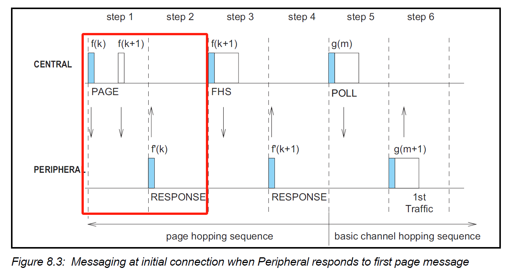

依据spec流程链路层page ID包发出去后，对方设备是否回复ID。如下空口log看Page过程的ID包，对方未响应，因此对方未打开可连接模式。


### 3、通过协议栈syslog观察是否Page成功
观察协议栈syslog，检查若是出现PageTimeout，对应错误码04。

```text
[08/09 19:26:38.620200] [28] [ap] ---->[HCI][CMDN][P:1,$:1][-Create_Connection][status:PAGE TIMEOUT | 04]
[08/09 19:26:38.621300] [28] [ap]      [Connection_Complete][T:0x200ed280]
[08/09 19:26:38.622400] [28] [ap] GAP_IND_CONNECTION_EVENT: <addr: 28:02:2e:82:b9:22.0><type: 2><status: 0><error: 4>
```

### 4、通过HCI log可观察是否Page成功
如下，观察HCI log看Create Connection对应的HCI Connection Complete事件为Page timeout，则表示对方未打开可连接模式。

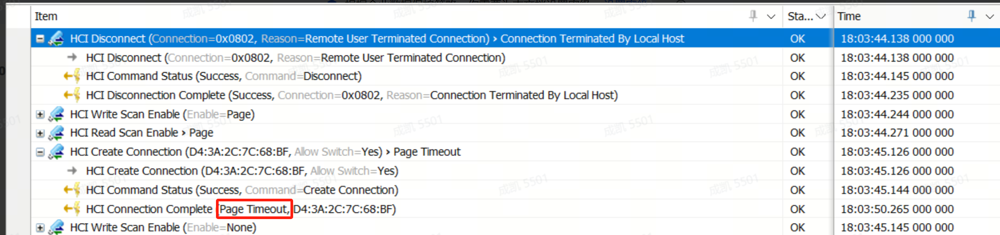


<a id="方法观察是否ACL连接超时断开"></a>

## 二、观察是否ACL连接超时断开（Connection Timeout）

通常，可以通过蓝牙服务log、airlog协议流程、协议栈syslog流程、snoop log等方式，观察对方设备是否异常超时断开连接。

### 1、通过蓝牙服务log可观察是否超时断开
如下，可通过btservice的log事件CONNECTION_STATE_DISCONNECTED，08错误表示连接超时断开错误码。

```text
[2024-12-31 20:04:31] [06/04 03:10:58.173500] [26] [ap] [660][adapter-svc]: ACL connection state changed, addr:28:02:2E:82:B9:22, link:0, state:CONNECTION_STATE_DISCONNECTED, status:0, reason:8
```

### 2、观察空口log，是否超时断开ACL连接

如下，可以通过空口log看，连接数据包在retry多次，直到最终超时断开。

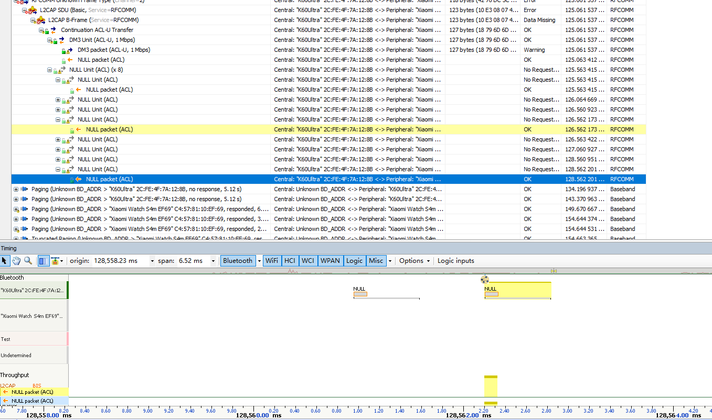


### 3、观察snoop log，是否超时断开
如下，观察snoop log蓝牙断开连接事件HCI Disconnect Complete事件，对应reason为connection timeout。


<a id="方法观察是否已经绑定成功，但是未有Profile连接，ACL主动断开"></a>

## 三、观察是否已经绑定成功，但是未有Profile连接，ACL主动断开

通常，可以通过蓝牙服务log、airlog协议流程、协议栈syslog流程、snoop log等方式，观察双方是否有Profile连接，导致连接断开。

### 1、观察蓝牙服务log，是否有Profile连接
观察本地btservice log，设备绑定成功后，没有A2DP、SPP等Profile连接，ACL连接成功一段事件后，出现ACL连接断开事件
如下，从btservice log看acl建立连接成功，SDP完成后，未连接其他Profile连接，最终断开错误码reason:19，表示对方主动断开。


### 2、观察HCI log，是否有Profile连接
如下，从HCI log看ACL连接成功，设备绑定完成后，SDP服务发现完成，未连接其他Profile，最终设备断开Remote User Terminated Connection（图上是对方主动断开，也很有可能本地协议栈主动断开）。


### 3、观察空口log，是否有Profile连接
如下，从空口log看ACL连接成功，设备绑定完成后，SDP服务发现完成，未连接其他Profile，最终设备Detach断开（图上是对方主动断开，也很有可能本地协议栈主动断开）。


<a id="方法观察是否本地配对信息无效"></a>

## 四、观察是否本地配对信息无效（Linkey Missing）

### 1、观察HCI log，手表本地配对信息无效，手机保存上次配对信息
如下，HCI log看本地linkkey未空，发起配对时Host端回复Negative Reply，然后重启发起配对，最终在Simple Pairing Complete阶段提示Authentication Fail，断开连接。

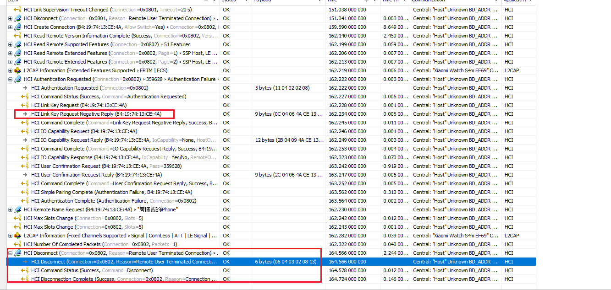

### 2、观察空口log，手表本地配对信息无效，手机保存上次配对信息
如下，从空口log看，手表本地配对信息无效，手机保存上次配对信息,提示DH Key Check失败。

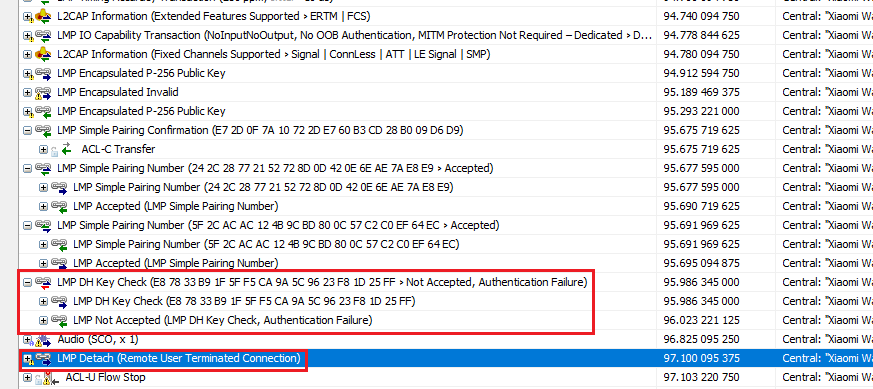

### 3、观察协议栈log，手表本地配对信息无效，手机保存上次配对信息
如下，观察协议栈log，手表本地配对信息无效，手机保存上次配对信息,从协议栈的HCI log Authentication_Complete时收到PIN OR KEY MISSING，最终配对失败。

```text
[ 1103.523193] [13] [cp]    ->[L2CAP,PSM:3][Out][Request:][RequestNum:0]
[ 1103.526428] [13] [cp] ---->[HCISEC][Go][Link_Bondable][Link_Bonded][Node_Encrypt]
[ 1103.526916] [13] [cp]    ->[Link:P256,LinkKey,Bonded,Bondable[key_type:Unauthenticated Combination Key generated from P256 | 07]
[ 1103.527282] [13] [cp]    ->[SSP_Enable][SC_Enable][SSP:OK][LinkKey_Good]
[ 1103.527526] [13] [cp]    ->[Local_Bondable:General]
[ 1103.528625] [13] [cp] ---->[HCI][CMDN][P:0,$:2][+Authentication_Requested]
[ 1103.532348] [13] [cp] ---->[HCI][*Send][AID:0,PLen:2][Authentication_Requested]
[ 1103.532653] [13] [cp]    ->[connection_handle:0129 | 81,00]
[ 1103.537719] [13] [cp] 
------>FSM Func Start<------
[ 1103.538024] [13] [cp] ---->[HCI][*Recv][AID:0,PLen:4][Command_Status]
[ 1103.538269] [13] [cp]    ->[status:OK | 00]
[ 1103.538574] [13] [cp]    ->[num_hci_command_packets:05 | 05]
[ 1103.538818] [13] [cp]    ->[command_opcode:Authentication_Requested]
[ 1103.542419] [13] [cp] 
------>FSM Func Start<------
[ 1103.542785] [13] [cp] ---->[HCI][*Recv][AID:0,PLen:6][Link_Key_Request]
[ 1103.543029] [13] [cp]    ->[bd:3c,13,5a,d5,a3,f6]
[ 1103.544311] [13] [cp] ---->[HCI][CMDN][P:1,$:2][+Link_Key_Request_Reply]
[ 1103.550903] [13] [cp] ---->[HCI][*Send][AID:0,PLen:22][Link_Key_Request_Reply]
[ 1103.551330] [13] [cp]    ->[bd:3c,13,5a,d5,a3,f6]
[ 1103.551635] [13] [cp]    ->[link_key:22,04,a4,2b,af,19,c3,ac,bc,02,f5,63,19,46,59,8d]
[ 1103.557250] [13] [cp] 
------>FSM Func Start<------
[ 1103.557617] [13] [cp] ---->[HCI][*Recv][AID:0,PLen:10][Command_Complete]
[ 1103.557861] [13] [cp]    ->[num_hci_command_packets:05 | 05]
[ 1103.558166] [13] [cp]    ->[command_opcode:Link_Key_Request_Reply]
[ 1103.558410] [13] [cp]    ->[status:OK | 00]
[ 1103.558654] [13] [cp]    ->[bd:3c,13,5a,d5,a3,f6]
[ 1103.560180] [13] [cp] ---->[HCI][CMDN][P:2,$:2][-Link_Key_Request_Reply][status:OK | 00]
[ 1103.560607] [13] [cp]    ->[COMMAND_COMPLETE][T:0x205658c0]
[ 1103.579223] [13] [cp] 
------>FSM Func Start<------
[ 1103.579528] [13] [cp] ---->[HCI][*Recv][AID:0,PLen:3][Authentication_Complete]
[ 1103.579833] [13] [cp]    ->[status:PIN OR KEY MISSING | 06]
[ 1103.580078] [13] [cp]    ->[connection_handle:0129 | 81,00]
[ 1103.581848] [13] [cp] ---->[HCI][CMDN][P:1,$:2][-Authentication_Requested][status:PIN OR KEY MISSING | 06]
[ 1103.582275] [13] [cp]    ->[Authentication_Complete][T:0x205680e0]
[ 1103.583557] [13] [cp] ---->[HCISEC][ResultEv][Failed:0x6][Ev:Authenticate]
------>FSM Func Start<------
[ 1104.618957] [13] [cp] ---->[HCI][Link][ACL][IdleExpire]
[ 1104.619201] [13] [cp]    ->[Local:[Identity:82,77,16,b2,4e,7b,Pub]]
[ 1104.619506] [13] [cp]    ->[Remote:[BREDR][Identity:3c,13,5a,d5,a3,f6,Pub][LELink:3c,13,5a,d5,a3,f6,Pub]]
[ 1104.619934] [13] [cp]    ->[HDL:0x81][Sending:0][Recv:N:0][Initiator][Connection_Completed][Master][Ref:0][READY_OK][LinkMode:Active]
[ 1104.621215] [13] [cp] ---->[HCI][CMDN][P:0,$:2][+Disconnect]
[ 1104.625915] [13] [cp] ---->[HCI][*Send][AID:0,PLen:3][Disconnect]
[ 1104.626281] [13] [cp]    ->[connection_handle:0129 | 81,00]
[ 1104.626586] [13] [cp]    ->[reason:REMOTE USER TERMINATED CONNECTION | 13]
```

<a id="方法观察是否对方配对信息无效"></a>

## 五、观察是否对方配对信息无效（Linkey Missing）

### 1、观察HCI log，手机配对信息无效，本地配对信息有效
如下，snoop  log看本地发起绑定过程，上报hci Authentication completed事件，对应的原因是PIN Or Key Missing。

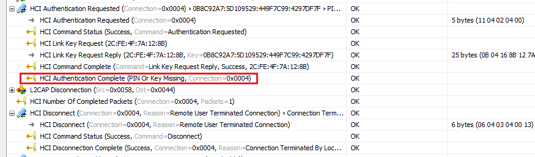

### 2、观察空口log，手机配对信息无效，本地配对信息有效
如下, air log看本地发起绑定，在LMP Authentication过程，提示LMP Not Accepted，原因是PIN Or Key Missing。


<a id="观察本地是否打开可连接模式"></a>

## 六、观察本地是否打开可连接模式

### 1、观察手表进入蓝牙耳机可连接模式
如下，进入蓝牙耳机搜索连接页面，让手表进入可连接模式。


### 2、观察miwear syslog，手表进入可连接模式
如下，观察miwear syslog，确认手表scan mode会进入CONNECTABLE模式。

```text
[42] [ap] [bt] bind_manager_set_visibility: scan mode: [CONNECTABLE DISCOVERABLE]
```

### 3 观察snoop log、 airlog等，手表进入可连接模式

通过，如上[观察是否对方设备未打开可连接模式](#方法观察是否对方设备未打开可连接模式)，确认手表scan mode会进入CONNECTABLE模式。

<a id="方法观察对方是否发起回连操作"></a>

## 七、观察对方是否发起回连操作

### 1、观察蓝牙服务syslog，耳机端发起回连操作

如下，通过蓝牙服务syslog，观察对方是否发起回连接请求。

```text
[27] [ap] [723][adapter-svc]: ACL connection state changed, addr:XX:XX:XX:XX:2E:43, link:1, state:CONNECTION_STATE_CONNECTING, status:0, reason:0
[27] [ap] [723][adapter-svc]: ACL connection state changed, addr:XX:XX:XX:XX:2E:43, link:1, state:CONNECTION_STATE_CONNECTING, status:0, reason:0
[27] [ap] [688][adapter-svc]: ACL Connect Request from :XX:XX:XX:XX:2E:43
```

### 2、观察snoop log，耳机端发起回连操作

如下，snoop log看耳机端发起回连操作，最终连接成功。


### 3、观察空口log，耳机端发起回连操作
如下，空口log看手机发起回连操作，最终连接成功。


<a id="方法观察本地是否收到ACL连接请求"></a>

## 八、观察本地是否收到ACL连接请求

### 1、观察syslog，本端蓝牙应用是否接收到ACL连接请求

蓝牙服务与蓝牙应用均能够接收到ACL连接请求，log如下。

```text
[15] [cp] [723][adapter-svc]: ACL connection state changed, addr:XX:XX:XX:XX:2E:43, link:1, state:CONNECTION_STATE_CONNECTING, status:0, reason:0
[15] [cp] [688][adapter-svc]: ACL Connect Request from :XX:XX:XX:XX:2E:43
[19] [cp] [BT] gap_connection_state_changed_callback: --->Device [XX:XX:XX:XX:2E:43][BREDR] State: CONNECTING
```

当应用无法收到ACL连接请求时，无法做出ACL连接回复，可以观察到如下ACL连接失败的log，输出Error Code 16，即Connection Accept Timeout Exceeded。

```text
[19] [cp] [109][bluelet]: sal_status_translate maybe hcierror code: 16
[14] [cp] [723][adapter-svc]: ACL connection state changed, addr:A4:E2:87:D7:2E:18, link:1, state:CONNECTION_STATE_DISCONNECTED, status:47, reason:0
```

<a id="方法观察本地是否同意ACL连接请求"></a>

## 九、观察本端是否同意ACL连接请求

### 1、观察蓝牙服务syslog，本端蓝牙应用是否同意ACL连接请求

如果应用未能同意ACL连接请求，可以观察到如下ACL连接失败的log如下，输出ACL status 55，表示本端拒绝了ACL连接请求。

```text
[15] [cp] [723][adapter-svc]: ACL connection state changed, addr:XX:XX:XX:XX:2E:43, link:1, state:CONNECTION_STATE_CONNECTING, status:0, reason:0
[15] [cp] [688][adapter-svc]: ACL Connect Request from :XX:XX:XX:XX:2E:43
......
[15] [cp] [723][adapter-svc]: ACL connection state changed, addr:XX:XX:XX:XX:2E:43, link:1, state:CONNECTION_STATE_DISCONNECTED, status:55, reason:0
```

### 2、观察对端设备snoop log，确认本端是否同意ACL连接请求

可以看到如下log，ACL连接被拒绝，显示Connection Rejected Due To Limited Resources。


<a id="观察是否成功开启扫描"></a>

## 十、观察是否成功开启扫描

### 1、观察蓝牙syslog，看设备是否成功开启扫描

status为0表示成功开启扫描，status为1表示关闭扫描。

```
bttool> [bttool] on_scan_start_status_cb, scanner:0xdf7943b0, status:0
[   24.055800] [20] [ DEBUG] [446][scanner]: scan_on_state_changed, state:0
```

### 2、观察HCI log，看HCI CMD是否发送成功，HCI EVT是否返回status是否正常

如下，HCI log看设备成功发起扫描，最终返回status正常。

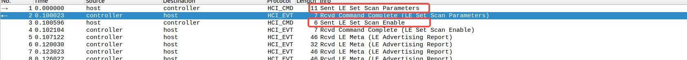


<a id="方法：确认对端设备存在对应SPP服务"></a>

## 十一、确认对端设备存在对应SPP服务

### 1、观察对端设备snoop log，确认对端设备是否存在对应的SPP服务

spp client发起spp连接，需要获取到对端设备的spp服务信息。可以通过对端设备的snoop log确认是否存在想要的SPP服务。

查询特定服务失败snoop log如下：


<a id="方法：确认SPP连接状态与断连发起方"></a>

## 十二、确认SPP连接状态与断连发起方

### 1、观察syslog，确认断连发起方

主动断开SPP连接与被动断开SPP连接会呈现不同的SPP连接状态转换log。

主动断开SPP连接,连接状态会从已连接（2）跳转到断连中（3）后，再跳转到断连（4）状态，典型log如下：

```text
[15] [cp] [732][spp]: spp_on_connection_state_chaneged, addr: XX:XX:XX:XX:2E:43, scn: 5, port: 0, state: 1
[15] [cp] [732][spp]: spp_on_connection_state_chaneged, addr: XX:XX:XX:XX:2E:43, scn: 5, port: 0, state: 2
......
[15] [cp] [732][spp]: spp_on_connection_state_chaneged, addr: XX:XX:XX:XX:2E:43, scn: 5, port: 0, state: 3
......
[15] [cp] [732][spp]: spp_on_connection_state_chaneged, addr: XX:XX:XX:XX:2E:43, scn: 5, port: 0, state: 0
```

被动断开SPP连接，连接状态会从已连接（2）直接跳转到断连（0）状态，典型log如下：

```text
[15] [cp] [732][spp]: spp_on_connection_state_chaneged, addr: XX:XX:XX:XX:2E:43, scn: 5, port: 0, state: 1
[15] [cp] [732][spp]: spp_on_connection_state_chaneged, addr: XX:XX:XX:XX:2E:43, scn: 5, port: 0, state: 2
......
[15] [cp] [732][spp]: spp_on_connection_state_chaneged, addr: XX:XX:XX:XX:2E:43, scn: 5, port: 0, state: 0
```

### 2、观察snoop log，确认断连发起方

### 3、观察air log，确认断连发起方

<a id="发现连接配对典型问题"></a>

## 典型问题

<a id="问题-经典蓝牙设备主动绑定对方设备失败"></a>

### 1、经典蓝牙设备主动绑定对方设备失败

设备绑定包括设备连接流程、绑定配对流程、协议连接过程。可通过如下方法，进一步定位原因。

第一步检查设备ACL连接状态，确认是否建立成功。若是连接失败，可通过如下手动辅助定位，否则，进入第二步骤检查设备配对状态。
* [观察是否对方设备未打开可连接模式](#方法观察是否对方设备未打开可连接模式)
  * 若是对方设备未打开可连接模式，建议观察手机端未打开可连接模式原因。
  * 否则，建议按照如下步骤进一步分析。

* [观察是否ACL连接超时断开(Connection Timeout)](#方法观察是否ACL连接超时断开)
  * 若是在通信距离有效方位内，出现链路层连接超时，请补充空口log及HCI log，一般需要芯片厂商进一步确认蓝牙Controller行为。
  * 否则，建议按照如下步骤进一步分析。

第二步检查设备配对状态，确认是否配对成功。若是配对失败，可通过如下手段辅助定位，否则，进入第三步骤检查Profile连接状态。
* [观察是否本地配对信息无效(Linkey Missing)](#方法观察是否本地配对信息无效)
  * 若本地Linkey无效或者丢失（离线取消配对），对方绑定信息有效，手表主动发起配对可能失败，符合预期。
  * 否则，建议按照如下步骤进一步分析。

* [观察是否对方配对信息无效(Linkey Missing)](#方法观察是否对方配对信息无效)
  * 若对方Linkey无效或者丢失（离线取消配对），本地绑定信息有效，手表主动发起配对可能失败，符合预期。
  * 否则，建议上传蓝牙服务log、协议栈log、空口log和手机snoop log，再进一步分析。

第三步检查Profile连接状态，确认是否连接成功。若没有Profile连接，可通过如下手段辅助定位，否则，可能蓝牙协议栈问题，建议保存蓝牙服务log、协议栈log、空口log和手机snoop log完整log，联系Vela蓝牙开发工程师求助。
* [观察是否已经绑定成功，但是未有Profile连接，ACL主动断开](#方法观察是否已经绑定成功，但是未有Profile连接，ACL主动断开)
  * 若ACL连接成功后，未连接A2DP、HID等Profile，设备会断开，符合预期。
  * 否则，建议按照如下步骤进一步分析。


<a id="问题-耳机断开后回连手表失败"></a>

### 2、耳机断开后回连手表失败

耳机回连手表行为，是由耳机端发起，同时需要手表打开可发现连接模式。可通过下面方法，进一步定位原因。

* [观察本地是否打开可连接模式](#方法观察本地是否打开可连接模式)
  * 若是手表设备未打开可连接模式，建议手表停留在耳机连接设置页面，保证手表进入可发现连接模式。
  * 否则，建议按照如下步骤进一步分析。
  
* [观察对方是否发起回连操作](#方法观察对方是否发起回连操作)
  * 若耳机未主动发起回连请求， 则需要耳机端进一步分析。
  * 否则，建议上传蓝牙服务log、协议栈log、空口log和手机snoop log，手表端进一步分析。

<a id="问题-经典蓝牙设备未被对端设备成功连接"></a>

### 3、经典蓝牙设备未被对端设备成功连接

对端设备主动连接失败，可通过下面方法，进一步定位原因。

* [观察本地是否打开可连接模式](#方法观察本地是否打开可连接模式)
  * 若是设备未打开可连接模式，建议查看蓝牙应用设置的Scan Mode。
  * 否则，建议按照如下步骤进一步分析。

* [观察本地是否成功收到ACL连接请求](#方法观察是否本地是否收到ACL连接请求)
  * 若是蓝牙服务未输出连接请求信息，则需要确认蓝牙设备处于蓝牙通信范围。
  * 进一步地，可以抓取Air log确认射频以及链路问题，寻求Controller供应商支持。
  * 否则，建议按照如下步骤进一步分析。

* [观察本地是否同意ACL连接请求](#方法观察本地是否同意ACL连接请求)
  * 若是蓝牙应用未同意连接请求，请确认应用端拒绝连接行为逻辑是否符合预期。
  * 否则，建议上传蓝牙服务log、协议栈log，进一步分析。

### 4、低功耗蓝牙扫描不到对端设备

低功耗蓝牙的扫描过程，通常是由central设备开始扫描行为，接收对端发起的广播。可通过下面方法，进一步定位原因。

* [观察是否成功开启扫描](#观察是否成功开启扫描)
  * 若是成功开启，需要保证设置的扫描间隔和扫描窗口是否合适，并且确保此时没有音频业务或其他高吞吐业务占用带宽资源。
  * 否则，建议上传syslog、协议栈log和带广播设备广播包的snoop log进一步分析确认。

### 5、SPP主动连接失败

SPP主动连接失败问题，首先需要按照《发现、连接、配对问题》章节的分析方法，确认ACL连接是否正常建立。在确认ACL连接正常建立后，可以按照下面方法进一步分析。

* [确认对端设备存在对应SPP服务](#方法：确认对端设备存在对应SPP服务)
  * 若对端未注册对应的SPP服务，需要对对端设备进一步分析。
  * 否则，建议按照如下步骤进一步分析。

* [确认SPP连接状态与断连发起方](#方法：确认SPP连接状态与断连发起方)
  * 若是之前的SPP连接尚未断开，则需要确认SPP连接双方是否有发起断连操作。
  * 否则，建议上传蓝牙服务log、协议栈log、空口log和手机snoop log，进一步分析。

### 6、CTKD BLE LTK 生成 BR LinkKey 失败

 Vela CTKD 流程在 Host 端完成，抓取 OTA/HCI 日志可以确认 BLE 配对过程是否正常。CTKD 问题深入分析需配合 vela 协议栈日志进行。

#### 6.1 打开协议栈 Debug 功能

```c
log enable stack
logmask 1 2 7
```

具体的 mask 掩码定义，请参考《bttool 使用说明文档》-《log 子命令》。

若需打开除掩码 1 和 2 外其他的协议栈 debug 日志功能，请联系 vela 蓝牙开发人员开启对应宏配置并重新编译协议栈静态库。

#### 6.2 复现问题

按照具体场景进行问题复现，并记录相关日志。

#### 6.3 日志解读

* 在日志中全局搜索关键字 `SMP` 或 `CTKD`。
* 若日志显示 `CTKD LE2BR OFF [LESC disabled]`，意味着从 BLE 到 BR 方向的 CTKD 功能被关闭，原因是未启用 LESC 功能。
* 若日志显示 `[BR2LE OFF] [Disabled]`，表示 LinkKey 到 LTK 方向的 CTKD 功能被 APP 禁用。

- 在抓取的日志中全局搜索关键字 `SMP` 或 `CTKD`。
- 若日志显示 `CTKD LE2BR OFF [LESC disabled]`，意味着从 BLE 到 BR 方向的 CTKD 功能已被关闭，原因是未启用 LESC 功能；
- 若日志显示 `[BR2LE OFF] [Disabled]`，表示 LinkKey 到 LTK 方向的 CTKD 功能已被 APP 禁用。

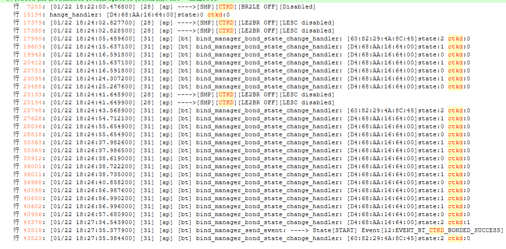

#### 6.4 如何确认当前 LinkKey 是否由 CTKD 生成？

如下日志示例中，`state:2` 和 `ctkd:1` 表示设备已绑定，且使用 CTKD 生成了 LinkKey：

```
[ap] [bt] bind_manager_bond_state_change_handler: [D4:68:AA:16:xx:xx] state:2 ctkd:1
[ap] [bt] bind_manager_send_event: ----> State[START] Event[12:EVENT_BT_CTKD_BONDED_SUCCESS]
```

### 7、设备通过 RPA 地址广播未建立连接

通过抓取空口日志观察 BLE 配对流程是否符合预期。

#### 7.1 BLE 配对状态机与流程图

- BLE 配对状态机：


- BLE 配对流程图：

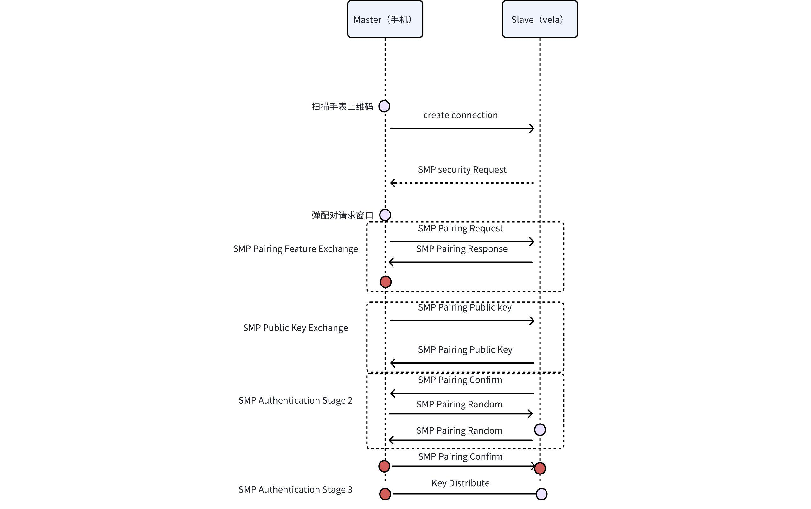

#### 7.2 设备通过 RPA 地址广播建立连接过程

- Ellisys 空口日志中过滤仅保留手表与 iPhone 手机的 RPA 地址：


- 手表通过 RPA 地址发送 Connectable 广播：


- iPhone 手机发送 Scan Request，手表回复 Scan Response 后，手机发送 Connection Indication Packet 完成连接：


#### 7.3 确认 BLE 配对完成

- SMP 配对过程顺利完成，双方均支持 LESC，IdKey 分发正常，LinkKey 标志为 1：


#### 7.4 确认 IRK 交换成功

- IRK 成功交换后，存入 Resolving List：


#### 7.5 确认通过 Identity 地址建立 BR/EDR 连接

- Controller 主动向 Host 请求 LinkKey，并校验通过，无需再次进行 BR/EDR 配对：


- 从空口日志进一步确认 LinkKey 校验成功：


#### 7.6 断连/重启后回连情况

设备信息参考：

| 设备名称                | 地址                                                 | 模式       | 描述               |
| ----------------------- | ---------------------------------------------------- | ---------- | ------------------ |
| REDMI Watch 5 eSIM F345 | 46:E3:3F:E2:8D:2E (Resolvable)                       | Low Energy | REDMI Watch 5 eSIM |
| REDMI Watch 5 eSIM F345 | 3C:AF:B7:FC:F3:45                                    | Dual Mode  | REDMI Watch 5 eSIM |
| xxx的 iPhone            | B4:19:74:13:CE:4A                                    | Dual Mode  | xxx的 iPhone       |
| xxx的 iPhone            | 6B:FC:EE:54:F0- [适配启动](./adapter_and_startup.md) |

设备重启后，Resolving List 需要更新到 Controller，重新建立连接：


正常断连回连情况：

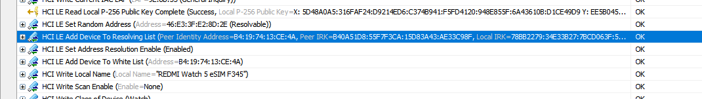

### 8、设备使用 Public 地址未连接成功

使用 Public 地址配对时，不生成或分发 IRK，无 IdKey 位：

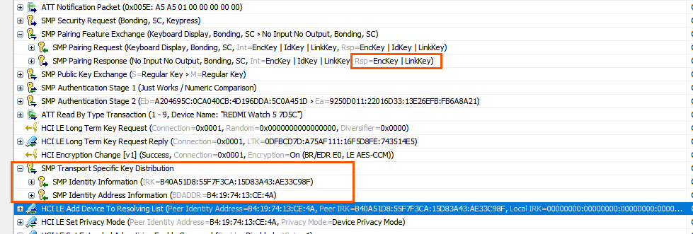

BR/EDR LinkKey 正常生成：


