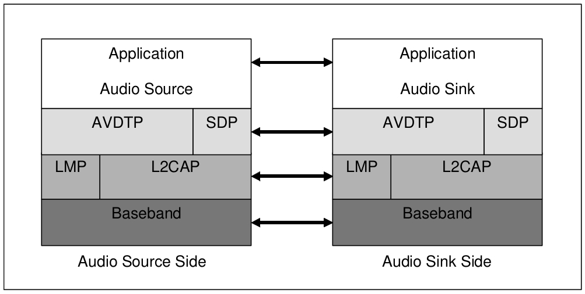
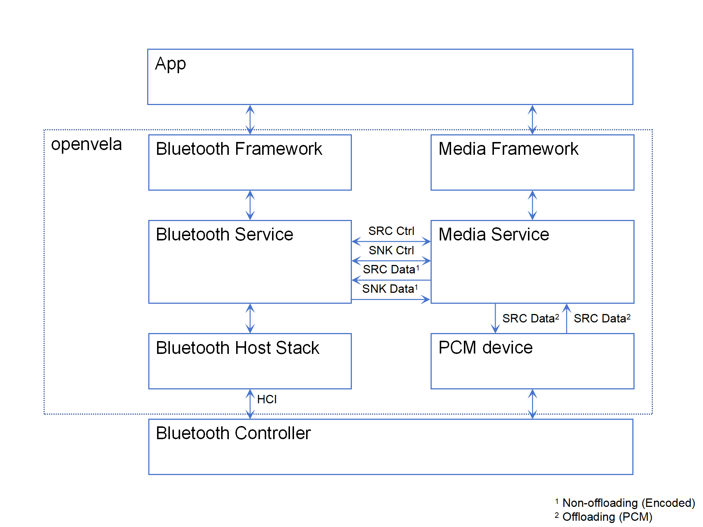
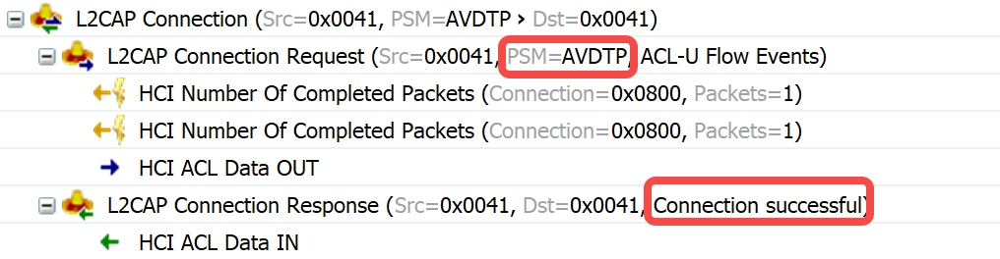
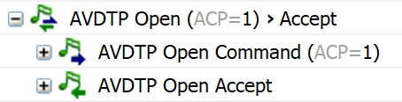
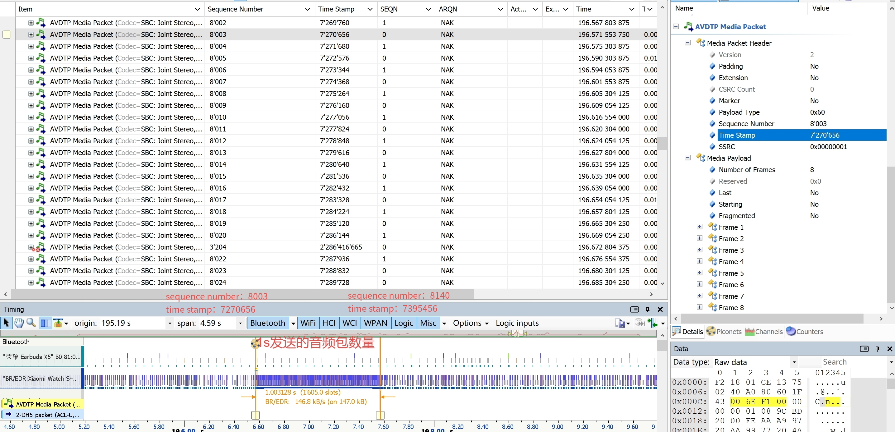

<!-- title: 如何分析蓝牙问题 -->

<!-- omit from toc -->

# 音频传输问题

本章介绍Advanced Audio Distribution Profile（A2DP）和Audio/Video Distribution Transport Protocol（AVDTP）相关问题常用的分析、定位方法。AVDTP负责控制音频/视频的传输过程，而A2DP定义了音频数据的编码和传输规范，通过这两个协议配合工作，可以实现在蓝牙设备之间高质量的音频传输。

A2DP是蓝牙音频分发配置协议，包含Source（SRC）和Sink（SNK）两个角色。通常，SRC是音频源，SNK是音频接收方。Vela蓝牙服务框架中，蓝牙音乐源设备（例如手机/手表）可以为A2DP-SRC，蓝牙音乐输出设备（例如音箱/耳机/车机）可以为A2DP-SNK。
AVDTP是蓝牙音频传输控制协议，协议中定义了Stream End Point(SEP) Discovery过程、Get Capabilities/Get All Capabilities过程、Stream Configuration过程、Stream Configuration过程、Stream Establishment、Stream Start、以及Stream Suspend等AVDTP信令过程。AVDTP信令过程的发起方称为Initiator（INT），信令过程的接收方称为Acceptor (ACP)。当两个蓝牙设备间传输音频时，需要预先建立两条AVDTP连接。首先建立的称为AVDTP signaling连接，用于编解码参数的协商和media连接的控制；协商完成后，再次建立一条AVDTP连接，称为AVDTP media连接，用于传输音频数据。A2DP和AVDTP协议栈的层级结构如下图所示



在Vela蓝牙协议栈之上，Vela蓝牙子系统还提供了A2DP服务层，A2DP服务于多媒体子系统中的Media服务之间存在多个传输通路，称为transport channels。这些transport channel可以分为两类：用于传输控制信令的control channel，以及用于传输音频数据的data channel，如下图所示



<a id="方法：观察蓝牙和Media之间的transport是否正确建立"></a>

## 一、观察蓝牙和Media之间的transport是否正确建立

在蓝牙子系统初始化时，A2DP服务会创建socket server，随后，Media服务作为socket client与蓝牙建立连接，从而允许控制信令和音频数据在两个子系统之间传输。通常，可以通过syslog观察蓝牙和Media之间的control channel和data channel是否正确建立。

典型log如下：

* A2DP SRC与Media之间正确建立transport channel
```
[a2dp_control]: a2dp_ctrl_cb, path:[a2dp_source_ctrl], event:TRANSPORT_OPEN_EVT
[a2dp_control]: a2dp_data_cb, path:[a2dp_source_data], event:TRANSPORT_OPEN_EVT
```

* A2DP SNK与Media之间正确建立transport channel
```
[a2dp_control]: a2dp_ctrl_cb, path:[a2dp_sink_ctrl], event:TRANSPORT_OPEN_EVT
[a2dp_control]: a2dp_data_cb, path:[a2dp_sink_data], event:TRANSPORT_OPEN_EVT
```

<a id="方法：观察是否建立了AVDTP signaling连接"></a>

## 二、观察是否建立了AVDTP signaling连接

AVDTP signaling连接是两个蓝牙设备建立音频连接的必要步骤。通常，可以通过snoop log或者air log观察是否建立了AVDTP signaling连接。

### 1、通过snoop log观察是否建立了AVDTP signaling连接，以及观察可能的失败原因

AVDTP signaling连接成功的典型log如下：



其中：AVDTP连接是一种L2CAP连接，L2CAP连接的种类由PSM标识。两个设备间建立的第一条AVDTP连接自动成为AVDTP signaling连接。

<a id="方法：观察是否建立了AVDTP media连接"></a>

## 三、观察是否建立了AVDTP media连接

建立AVDTP media连接之前，可能会进行Discovery、Get (ALL) Capabilities、Set/Get Configuration、Stream Establishment等过程，其中，Set Configuration和Stream Establishment过程是必要过程。通常，可以通过syslog、snoop log或者air log观察是否建立了AVDTP media连接。

### 1、通过snoop log观察是否建立了AVDTP media连接，以及观察可能的失败原因

以下几个示例展示了两个设备建立AVDTP media连接的过程。

#### 1.1 AVDTP Discovery

可选的，在建立AVDTP media连接之前，可以发起AVDTP Discovery过程，用于发现对端设备可用的Stream End Point(SEP)。通常，发起AVDTP signaling连接的设备会发起这一过程。典型log如下：


Log显示ACP的序号从1到6，表明该设备的拥有的SEP至少有6个。

#### 1.2 AVDTP Get Capabilities

可选的，在建立AVDTP media连接之前，可以通过Get Capabilities或者Get All Capabilities获取对端设备SEP的具体信息。通常，发起AVDTP signaling连接的设备会发起这一流程。典型log如下：


Log展示了获取编号为1的SEP的具体信息的过程，其中，编码格式为SBC，采样率为44.1kHz。

#### 1.3 AVDTP Set Configuration

在建立AVDTP media连接之前，需要通过Set Configuration过程指定双方的SEP，以及编解码参数。通常，发起AVDTP signaling连接的设备应当发起这一流程。典型log如下：


Log中显示该流程的发起方请求使用1号SEP和对端设备的1号SEP建立连接。

#### 1.4 AVDTP Stream Establishment

在建立AVDTP media连接之前，需要通过Open流程打开双方的SEP。通常，发起AVDTP signaling连接的设备应当发起这一流程。典型log如下：



#### 1.5 AVDTP media连接成功

完成Set Configuration和Stream Establish流程后，需要建立第二条AVDTP连接，也就是AVDTP media连接。通常，发起AVDTP signaling连接的设备应当发起这一流程。典型log如下：


通常，AVDTP Open完成后，随之建立的L2CAP（PSM=AVDTP）是AVDTP media连接。

### 2、通过syslog观察是否建立了AVDTP media连接，以及观察可能的失败原因

典型log如下：

* 本地设备被连接
```
[a2dp_stm]: ProcessEvent, State=Idle, Peer=[11:22:33:44:55:66], Event=CONNECTED_EVT
[a2dp_stm]: Enter State=Opened, Peer=[11:22:33:44:55:66]
```

* 本地设备主动连接对端设备
```
[a2dp_stm]: ProcessEvent, State=Opening, Peer=[11:22:33:44:55:66], Event=CONNECTED_EVT
[a2dp_stm]: Enter State=Opened, Peer=[11:22:33:44:55:66]
```

<a id="方法：观察Media是否成功设置了codec"></a>

## 四、观察Media是否成功设置了codec

传输或播放音乐前，需要在Media子系统设置编解码参数。可以通过syslog观察Media是否成功设置了编解码参数。

典型log如下：

```
[a2dp_control]: a2dp_recv_ctrl_data: a2dp-ctrl-cmd : A2DP_CTRL_CMD_CONFIG_DONE
```

<a id="方法：观察A2DP SRC是否开始播放音乐"></a>

## 五、观察A2DP SRC是否开始播放音乐

通常，可以通过syslog、snoop log或者air log观察A2DP SRC是否开始播放音乐。

### 1、通过syslog观察A2DP SRC是否开始播放音乐

在A2DP SRC端，Vela蓝牙服务开始播放音乐的流程由来自Media的命令触发，典型log如下：

```
[a2dp_control]: a2dp_recv_ctrl_data: a2dp-ctrl-cmd : A2DP_CTRL_CMD_START
```

当蓝牙服务收到开始播放音乐的命令时，会开始AVDTP Stream Start流程，并在流程成功结束后进入Started状态，典型log如下：

```
[a2dp_stm]: ProcessEvent, State=Opened, Peer=[11:22:33:44:55:66], Event=STREAM_START_REQ
[a2dp_stm]: ProcessEvent, State=Opened, Peer=[11:22:33:44:55:66], Event=STREAM_STARTED_EVT
[a2dp_stm]: Exit  State=Opened, Peer=[11:22:33:44:55:66]
[a2dp_stm]: Enter State=Started, Peer=[11:22:33:44:55:66]
```

### 2、通过air log观察A2DP SRC是否开始播放音乐

在音频流开始传输之前，A2DP SRC会发起Stream Start流程。在音频流传输过程中，A2DP SRC会向SNK发送media packets，典型log如下：


<a id="方法：观察A2DP SRC是否停止传输音频包"></a>

## 六、观察A2DP SRC是否停止音频流传输

通常，可以通过syslog、snoop log或者air log观察A2DP SRC是否停止音频流传输。

### 1、通过syslog观察A2DP SRC是否停止音频流传输

当Vela设备为A2DP SRC时，蓝牙服务有两个途径终止传输音频数据。

* 当收到Media发送的STOP命令时。

* 当连续2秒不能从Media获取音频数据时。

蓝牙服务收到Media发送的STOP命令时，典型log如下：

```
[a2dp_control]: a2dp_recv_ctrl_data: a2dp-ctrl-cmd : A2DP_CTRL_CMD_STOP
```

蓝牙2秒从media读不到数据，syslog中会打印如下log，且持续时间约2秒：

```
[src_sbc]: a2dp_sbc_send_frames, underflow :6
```

蓝牙服务发起Stream Suspend流程的典型log如下：

```
[a2dp_stm]: ProcessEvent, State=Started, Peer=[11:22:33:44:55:66], Event=STREAM_SUSPEND_REQ
[a2dp_stm]: ProcessEvent, State=Started, Peer=[11:22:33:44:55:66], Event=STREAM_SUSPENDED_EVT
[a2dp_stm]: Exit  State=Started, Peer=[11:22:33:44:55:66]
[a2dp_stm]: Enter State=Opened, Peer=[11:22:33:44:55:66]
```

### 2、通过snoop log观察A2DP SRC是否停止传输音频包

典型log如下：


## 七、观察AVDTP signaling连接是否断开

AVDTP signaling断开的原因包括以下几种：应用请求Vela蓝牙子系统断开A2DP连接，蓝牙协议栈主动断开连接，已经对端设备请求断开连接。通常，可以通过syslog，snoop log，或者air log观察是否断开了AVDTP signaling连接。

### 1、通过syslog观察是否断开了AVDTP signaling连接

当应用请求断开A2DP连接时，A2DP状态机会收到DISCONNECT_REQ，并随后断开AVDTP signaling连接，典型log如下：

```
[a2dp_stm]: ProcessEvent, State=Opened, Peer=[11:22:33:44:55:66], Event=DISCONNECT_REQ
```

断开连接完成时的典型log如下：

```
[a2dp_stm]: ProcessEvent, State=Closing, Peer=[11:22:33:44:55:66], Event=DISCONNECTED_EVT
[a2dp_stm]: Exit  State=Closing, Peer=[11:22:33:44:55:66]
[a2dp_stm]: Enter State=Idle, Peer=[11:22:33:44:55:66]
```

### 2、通过snoop log观察是否断开了AVDTP signaling连接，以及观察可能的失败原因

snoop log中AVDTP signaling连接断开的原因有两种：本地设备主动断开连接，以及对端设备请求断开连接。典型log如下：


<a id="方法：观察音频包序列号是否连续"></a>

### 八、观察音频包序列号是否连续

AVDTP Media Packet的包头中有一个字段，称为Sequence Number。该字段是音频包的序列号，会随着每一个AVDTP Media Packet发送而递增。
每一次Stream Start过程开始后，Sequence Number都从0开始，每发送一个AVDTP Media Packet，Sequence Number加1。
当该序列号中断或跳跃时，通常表示音频数据缺失。

典型log如下：


<a id="方法：观察air log中1秒内发送的音频数据样本点数量"></a>

## 九、观察air log中1秒内发送的音频数据样本点数量

AVDTP Media Packet的包头中有一个字段，称为Time Stamp。该字段表示了音频包的采样时刻，即该音频数据包中第一个样本点的编号。

在air log中，截取1秒内的音频包，开始和结束音频包之间的Time Stamp差是该时间段内传输的音频数据样本点数量。

通常，约1秒时间段内音频数据的样本点应当等于或近似等于采样率，典型log如下：


上述log中，实际传输的样本点数量为：5949440 - 5904896 = 44546。由于当前设置的采样率为44.1kHz，实际传输的样本点数量与预期接近。

1秒内音频数据的样本点数量远大于采样率时，通常air log中会看到比正常情形更加密集的包，典型log如下：



上述log中，约1秒时间段内实际传输的样本点数量为：7395456 - 7270656 = 124800，远超预期。

<a id="方法：观察air log中音频数据是否存在重传"></a>

## 十、观察air log中音频数据是否存在重传

air log中基带包有两个参数可以用来判断包是否存在重传，分别是SEQN和ARQN。正常情况下，SEQN的值在0和1之间交替变化，对端设备回复的ARQN是ACK。若出现重传，基带包中的SEQN值与上一包相同。

空口出现重传的原因有两种：

* 设备发送的包没收到对端的回复

* 设备发送的包收到了对端的回复，但回复的ARQN值为NAK

设备发送的包没收到对端的回复，典型log如下：


上述log中，设备发了3次2-DH5包，前两次发送的包没有收到对端设备的回复，因此再次重传，SEQN值维持不变；第三次发送的包收到了对端设备的回复，且回复的ARQN是ACK，因此重传结束。再次发送新数据时，可以观察到SEQN发生了变化。

设备发送的包收到了对端的回复，但回复的ARQN是NAK，典型log如下：


上述log中，设备发了2次2-DH5包，第一次发送的包收到了对端设备的回复，但ARQN为NAK，SEQN值维持不变；第二次的包收到了对端设备的回复，且回复的ARQN是ACK，因此重传结束。

<a id="方法：通过syslog判段A2DP-SNK音乐卡顿原因"></a>

### 十一、观察syslog判段A2DP-SNK音乐卡顿原因
A2DP-SNK音乐卡顿问题，Bluetooth service提供以下三个syslog，可以根据以下log进行分析：
```
[a2dp_snk_stream]: a2dp_sink_audio_handle_timer underflow, miss ticks: x

[a2dp_snk_stream]: ===a2dp cpu busy time:y, buff_cnt:z===
[a2dp_snk_stream]: ipc blocking, block ticks: w
```

其中，“underflow, miss ticks: x”表示bluetooth侧的数据buffer在x个ticks（20ms）中为空； “===a2dp cpu busy time: y, buff_cnt: z===”表示发送数据的事件已经 y us未执行，并且当前buffer中数据的个数为z；“ipc blocking, block ticks: w”表示与Media的ipc中阻塞了w个数据包。由于音频链路上有缓存数据的buffer，所以出现以上打印并不一定意味着会出现卡顿，通常x、y、w要大于一定值，才会实际表现出卡顿，具体值取决于Media侧buffer设置的大小。

**注意：该方法仅能进行问题的初步定位**。

### 1、观察A2DP-SNK音乐卡顿是否可能由基带芯片引起

若未出现“===a2dp cpu busy time: y, buff_cnt: z===”，但存在"underflow, miss ticks: x"，卡顿很有可能是因则优先怀疑音乐卡顿来自于基带芯片。

### 2、观察A2DP-SNK音乐卡顿是否可能由mips不足引起

若“===a2dp cpu busy time: y, buff_cnt: z===”与“===a2dp cpu busy time: y, buff_cnt: z===”交替出现，应优先怀疑卡顿由mips不足造成。

### 3、观察A2DP-SNK音乐卡顿是否可能由Bluetooth service

在syslog上，因为Bluetooth service产生的卡顿通常表现的类似于mips不足。

### 4、观察A2DP-SNK音乐卡顿是否可能由Media service

若出现“ipc blocking, block ticks: w”，说明发送给Media的音频数据没有被及时消费，导致在ipc通道前堆集了w个数据包，在这种情况下应优先考虑Media侧出现问题。

<a id="方法：观察A2DP-SNK卡顿是否来源于基带芯片"></a>

## 十二、观察A2DP-SNK卡顿是否来源于基带芯片

### 1、通过snoop log观察卡顿是否来源于基带芯片

典型log如下：\


其中，在时间段能收到AVDTP数据的time stamp应大致符合以下关系，（end_time(s) - start_time(s)) * samplerate <= end_time_stamp - start_time_stamp。

### 2、通过syslog观察卡顿是否来源于基带芯片

在基带芯片驱动处添加syslog可以直接判断音乐卡顿是否来源于基带芯片。\
**该syslog需要能确认基带芯片是否及时上报数据**，若未及时上报数据，则可以怀疑音乐卡顿来自于基带芯片。\
由于不同项目使用的基带芯片不同，所以对应的syslog如何添加/开启应该联系负责基带芯片驱动的工程师。

<a id="方法：观察A2DP-SNK卡顿是否来源于mips不足"></a>

## 十三、观察A2DP-SNK卡顿是否来源于mips不足

bluetoothd的优先级在整个系统中往往不是最高，所以如果出现系统mips不足，则有可能出现bluetoothd没有被及时调度去向media发送数据，从而导致Media侧未能及时接收到数据。

### 1、通过ps命令观察cpu负载情况

对于可持续的长时间卡顿问题，可以直接通过ps命令观察cpu负载情况。若idle task的cpu占用率已经很低/为零，说明存在mips不足的问题，则应先解决系统mips不足的问题。

### 2、通过工具命令观察cpu负载情况

对于偶现/不可持续的卡顿问题，可以通过抓取发生时间点的trace来分析是否存在短时间内的cpu占用率过高的问题。

<a id="方法：观察bluetoothd自身是否被阻塞"></a>

## 十四、观察bluetoothd自身是否被阻塞

### 1、通过debug log判断bluetoothd是否被阻塞

需要对整个蓝牙模块进行打点，可以通过脚本对蓝牙模块的所有函数添加打点log，在复现时间点根据打点log和代码流程观察是否有阻塞现象。

## 典型问题

### 问题一：连接耳机播放音乐，耳机无声

* [观察是否建立了AVDTP signaling连接](#方法观察是否建立了avdtp-signaling连接)

  * 若两个设备未能正确建立AVDTP signaling连接，建议对比典型log，观察AVDTP signaling连接建立过程中是否出现异常。

  * 若两个设备间正确建立了AVDTP signaling连接，建议[观察是否建立了AVDTP media连接](#方法观察是否建立了avdtp-media连接)

* [观察是否建立了AVDTP media连接](#方法观察是否建立了avdtp-media连接)

  * 若两个设备未能正确建立AVDTP media连接，建议对比典型log，观察AVDTP media连接建立过程中是否出现异常。

  * 若两个设备之间正确建立了AVDTP media连接，建议[观察Media是否成功设置了codec](#方法观察media是否成功设置了codec)

* [观察Media是否成功设置了codec](#方法观察media是否成功设置了codec)

  * 若Vela Media未能成功设置codec，建议在Vela Media模块观察未能设置codec的原因。

  * 若Vela Media成功设置codec，建议[观察A2DP SRC是否开始播放音乐](#方法观察a2dp-src是否开始播放音乐)

* [观察是否开始播放音乐](#方法观察a2dp-src是否开始播放音乐)

  * 若本地设备为A2DP SRC，且Vela Media未能发送音乐开始的命令，建议在Vela Media模块观察未能发送的原因。

  * 若本地设备为A2DP SRC，且Vela Media发送了音乐开始的命令，但耳机端无声，建议对比典型log，观察播放音乐流程中是否出现异常。

### 问题二：连接耳机播放音频文件，音频文件开头缺失

* [观察音频包序列号是否连续](#方法观察音频包序列号是否连续)

  * 若air log中出问题的音频流中存在音频包序列号不连续，建议在Vela蓝牙侧观察音频流中音频包的序列号不连续的原因。

  * 若音频包序列号连续，建议Vela Media侧观察发送的音频包是否完整。

### 问题三：语音播报，结尾处有pop音

### 问题四：连接两对耳机时，出现断连和无声的问题

Vela A2DP SRC当前不支持多设备连接，典型例子是：一个手表连接连接一对耳机。当手表需要连接另一对耳机时，需要先断开前一对耳机。针对多设备切换导致的无声问题，可以按以下顺序排查：

* [观察是否断开了第一耳机](#方法观察avdtp-signaling连接是否断开)

  * 若应用未能发送第一耳机断开请求，建议在App侧观察未能发送的原因。

  * 若应用发送了第一耳机断开请求，但未能断开，建议对比典型log，观察断开流程中是否出现异常。

  * 若应用在连接第二耳机前，正确断开了第一耳机，建议[观察是否连接了第二耳机](#方法观察是否建立了avdtp-media连接)

* [观察是否连接了第二耳机](#方法观察是否建立了avdtp-media连接)

  * 若应用未能发送第二耳机连接请求，建议在App侧观察未能发送的原因。

  * 若应用发送了第二耳机连接请求，但未能建立AVDTP signaling连接，建议对比典型log，观察建立signaling连接中是否出现异常。

  * 若两个设备之间的AVDTP signaling连接建立成功，但未能建立AVDTP media连接，建议对比典型log，观察建立media连接中是否出现异常。

  * 若两个设备之间的AVDTP media连接建立成功，建议观察[观察Media是否成功设置了codec](#方法观察media是否成功设置了codec)

* [观察Media是否成功设置了codec](#方法观察media是否成功设置了codec)

  * 若Vela Media未能成功设置codec，建议在Vela Media模块观察未能设置codec的原因。

  * 若Vela Media成功设置codec，建议观察[观察是否开始播放音乐](#方法观察a2dp-src是否开始播放音乐)

* [观察是否开始播放音乐](#方法观察a2dp-src是否开始播放音乐)

  * 若Vela Media未能发送音乐开始的命令，建议在Vela Media模块观察未能发送的原因。

  * 若Vela Media发送了音乐开始的命令，但耳机端无声，建议对比典型log，观察播放音乐流程中是否出现异常。

### 问题五: 连接耳机播放音乐，耳机无声

* [观察是否建立了AVDTP signaling连接](#方法观察是否建立了avdtp-signaling连接)

  * 若AVDTP signaling连接未建立，建议对比典型log，观察建立signaling连接中是否出现异常。

  * 若两个设备之间的AVDTP signaling连接建立成功，但未能建立AVDTP media连接，建议[观察是否建立了AVDTP media连接](#方法观察是否建立了avdtp-media连接)

* [观察是否建立了AVDTP media连接](#方法观察是否建立了avdtp-media连接)

  * 若两个设备之间的AVDTP media连接未建立，建议对比典型log，观察建立media连接中是否出现异常。

  * 若两个设备之间的AVDTP media连接建立成功，建议观察[观察Media是否成功设置了codec](#方法观察media是否成功设置了codec)

* [观察Media是否成功设置了codec](#方法观察media是否成功设置了codec)

  * 若Vela Media未能成功设置codec，建议在Vela Media模块观察未能设置codec的原因。

  * 若Vela Media成功设置codec，建议观察[观察是否开始播放音乐](#方法观察a2dp-src是否开始播放音乐)

* [观察是否开始播放音乐](#方法观察a2dp-src是否开始播放音乐)

  * 若Vela Media未能发送音乐开始的命令，建议在Vela Media模块观察未能发送的原因。

  * 若Vela Media发送了音乐开始的命令，但耳机端无声，建议对比典型log，观察播放音乐流程中是否出现异常。

### 问题六: 连接耳机播放音频文件，音频文件开头缺失

* [观察sequence number是否连续](#方法观察air-log中的音频包序列号是否连续)

  * 若air log中出问题的音频流中存在音频包序列号不连续，建议Vela蓝牙测观察音频流中音频包的序列号不连续的原因。

  * 若音频包序列号连续，建议Vela Media测观察发送的音频包是否完整。

### 问题七: 语音播报，结尾处有pop音

### 问题八: 连接手机播放音乐卡顿

对于该问题需要进行以下分析：

  [观察air log中音频数据是否存在重传](#方法：方法观察air-log中音频数据是否存在重传)\
  [通过syslog判段A2DP-SNK音乐卡顿原因](#方法：通过syslog判段A2DP-SNK音乐卡顿原因)

根据推测原因应进行以下分析：
* 若发现重传现象比较严重

* [观察A2DP-SNK卡顿是否来源于基带芯片](#方法：观察A2DP-SNK卡顿是否来源于基带芯片)

  * 若观察到snoop log中，AVDTP数据包数量不符合预期，需要进一步确认驱动处的数据包情况

    * 若观察到驱动处数据包数量异常，则需要进一步确认问题发生在基带芯片、空口处或者驱动处

* [观察A2DP-SNK卡顿是否来源于mips不足](#方法：观察A2DP-SNK卡顿是否来源于mips不足)

  * 若观察到idle task的cpu占用率过小，需要对系统的mips进行合理分配
  * 若通过trace观察到某一高优先级线程长时间占据cpu，则应该优化该线程的执行逻辑，避免高优先级线程执行计算密集型任务

* [观察bluetoothd自身是否被阻塞](#方法：观察bluetoothd自身是否被阻塞)

  * 若阻塞由于外部调用产生，则需要考虑该阻塞是否符合预期

    * 若不符合预期，则应优化该外部调用
    * 若符合预期，则需要异步执行该阻塞动作

  * 若阻塞由于bluetoothd内部产生，则需要对内部动作进行优化

* 对于Media service未及时消费音频数据的问题，需要联系Media service的开发人员确认。

### 问题九: 连接手机播放音乐无声