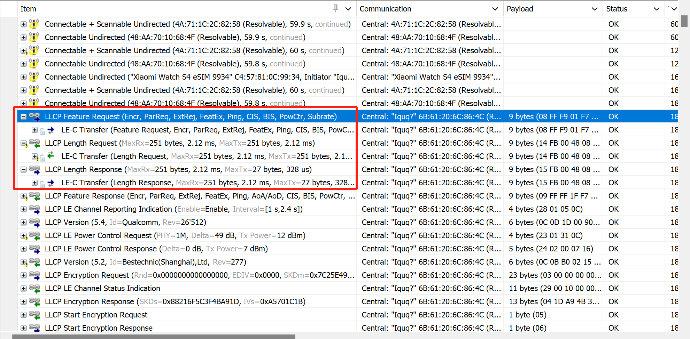
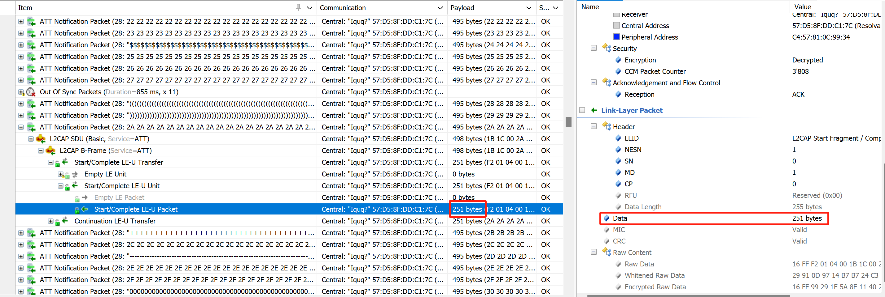
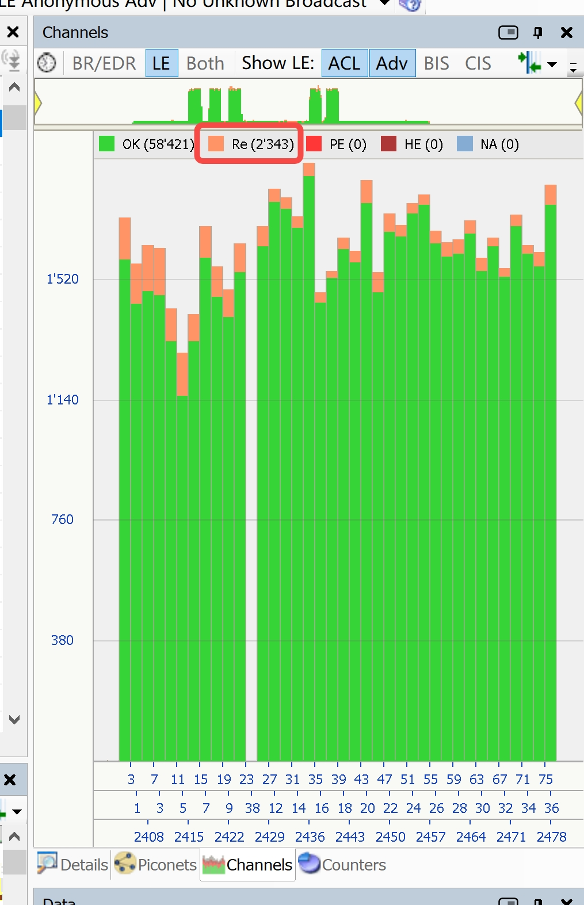
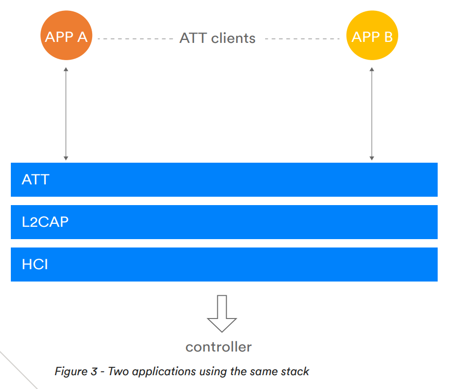

# 数据传输问题

本章介绍数据传输（GATT、 SPP）高吞吐传输过程中相关问题常用的分析、定位方法。
GATT是低功耗蓝牙通用属性协议，包含client和server两个角色。通常，主动发起连接的设备为client，被动接收连接的设备为server。设备可以同时充当client和server。GATT主要应用的高吞吐场景为，IOS OTA数据传输。

<a id="方法：分析GATT理论吞吐"></a>

## 一、分析GATT理论吞吐


链路层启用2M PHY及启用DLE，258 - 2 - 4 - 3 = 251Bytes，251 bytes / 1400μs = 179.3 kB/s

<a id="方法：观察LE数据包格式"></a>


<a id="方法：观察LE数据连接间隔"></a>

以7.5ms的连接连接为例，7.5ms/1.4ms = 5.35，（5 * 251B）/ 7.5ms = 167.3KB/s

<a id="方法：bttool测试GATT吞吐"></a>

## 二、bttool测试GATT吞吐

第一步，启动bttool 后的操作步骤如下：

```text
bttool> enable
bttool> gatts register 3
bttool> gatts start 3
bttool> adv start -m legacy -D
```

可参考如下log：

```text
bttool> enable
bttool> [03/13 12:45:42] [10] [cp] [394][adapter-stm]: Process, State=On, Event=SYS_TURN_ON
bttool>
bttool> gatts register 3
[bttool] register service successful, service_id: 3
bttool>
bttool> gatts start 3
bttool> [bttool] gatts add attribute table complete, handle 0x1, status:0
bttool>
bttool> adv start -m legacy -D
[bttool] adv type: legacy
[bttool] Advertising handle:0x2057c8e8
bttool> [bttool] on_advertising_start_cb, handle:0x2057c8e8, adv_id:1, status:0
[03/13 12:46:07] [13] [cp] AdvType:(Flags)
[03/13 12:46:07] [13] [cp] AdvData: (0x2050af8a):
[03/13 12:46:07] [13] [cp] 0000  08                                               .
[03/13 12:46:07] [13] [cp] AdvType:(Manufacturer Specific Data)
[03/13 12:46:07] [13] [cp] AdvData: (0x2050af8d):
[03/13 12:46:07] [13] [cp] 0000  8f 03                                            ..
[03/13 12:46:07] [13] [cp] AdvType:(Complete Local Name)
[03/13 12:46:07] [13] [cp] AdvData: (0x2050af92):
[03/13 12:46:07] [13] [cp] 0000  56 65 6c 61 2d 42 54    
```

第二步，使用手机发现和连接设备：
* 发现'Vela-BT'设备后点击'CONNECT'
* 连接测试设备后使能cccd描述字
* 若是未打开自动确认配对的话，使能cccd描述字会触发配对操作，需要同时在手机和设备上配对确认

可参考如下log：
```text
pair confirm xx:xx:xx:xx:xx:xx 0 1
[bttool] Device [xx:xx:xx:xx:xx:xx] ssp confirmation Accept
bttool> [bttool] Device [xx:xx:xx:xx:xx:xx][BREDR] bond state: BONDED, is_ctkd: 1
[bttool] Device [xx:xx:xx:xx:xx:xx][LE] bond state: BONDED, is_ctkd: 0
[03/13 13:02:34] [12] [cp] [384][bluelet]: link_encryption_state_callback isBRLink: 0, encrypted: 1
[03/13 13:02:35] [12] [cp] [1368][adapter-svc]: adapter_on_le_bonded_device_update
[03/13 13:02:35] [10] [cp] [526][adapter-svc]: DEVICE[xx:xx:xx:xx:xx:xx] LinkKey: 47 | [F61C890E646E82761F6719B350FDA6AD]
[03/13 13:02:35] [10] [cp] [821][adapter-svc]: LE BOND DEVICE[0]: Addr:[xx:xx:xx:xx:xx:xx] Atype:[1] LTK: [B7EE4D046FB572214C378DDB66614D77]
[03/13 13:02:35] [12] [cp] [428][bluelet]: ble_add_resolving_list_callback
[bttool] gatts service TX char ccc changed, addr:xx:xx:xx:xx:xx:xx
[03/13 13:02:35] [15] [cp] new value: (0x20574aa0):
[03/13 13:02:35] [15] [cp] 0000  01 00                                            ..
[03/13 13:02:36] [12] [cp] [384][bluelet]: link_encryption_state_callback isBRLink: 1, encrypted: 1
```

第三步，启动throughput测试：
*  nRF Connect APP调整连接间隔和MTU值
*  bttool中输入以下指令启动throughput测试
  
连接间隔和MTU直接影响throughput测试结果，可根据测试要求调整相应配置。

<a id="方法：检查是否打开DLE功能"></a>

## 三、检查是否打开DLE功能

可以在hci log、snoop log、airlog中检查是否打开LE Data Length Extension功能。

### 1、通过HCI log检查是否支持DLE


如上图，在初始化阶段，读取本地Feature，是否支持DLE。若是支持，则可以观察在Notification阶段，发送251字节数据包长度。

### 2、通过Air log检查是否支持DLE





如上图，在BLE连接阶段，可以在链路层请求查询对方Feature，Max 链路层TX和RX数据包是否支持251字节长度。若是支持，则可以观察在Notification阶段，发送251字节数据包长度。

<a id="方法：观察client设备是否发起过Exchange_MTU规程"></a>

## 四、观察client设备是否发起过Exchange_MTU规程

### 1、通过syslog观察client设备是否发起过Exchange_MTU规程

在连接建立完成后，client端一般会主动发起exchange_mtu规程，典型syslog如下：
```
[bttool] gatts_mtu_changed_callback, addr:AA:AA:AA:AA:AA:AA, mtu:514
```
MTU为20时，表示client端未发起exchange_mtu规程，syslog如下：
```
[bttool] gatts_mtu_changed_callback, addr:AA:AA:AA:AA:AA:AA, mtu:20
```

### 2、通过snoop log观察client设备是否发起过Exchange_MTU规程

典型log如下：


<a id="方法：分析每个连接间隔的最大Event数量"></a>

## 五、分析每个连接间隔的最大Event数量


如上图，以连接间隔15ms为例，在一个连接间隔内可最大交互10个Event（15ms/1400us=10.2）

<a id="#方法：观察当前空口环境是否复杂"></a>

## 六、观察当前空口环境是否复杂

蓝牙使用的2.4GHz ISM频段（2400-2483.5MHz）是免许可的公共频段，广泛用于Wi-Fi、微波炉、ZigBee、无线摄像头等设备。这些设备同时工作时会产生同频干扰，将会破坏数据包的完整性或者丢包现象，最终表现为空口环境中的高重传率。

### 1、通过snoop log观察当前空口环境是否复杂

可以从图中的粉色柱体看到整个传输过程中的重传率，如下代表信道质量尚可



<a id="方法：使用GATT_OVER_BR数据传输模式"></a>

## 七、使用GATT OVER BR数据传输模式

在经典蓝牙物理连接上传输GATT数据，利用经典蓝牙3M带宽。启动多时隙包3DH5，理论速率可提升到（1021-4-6）/ 0.625 * 6 = 269.6KB/s


<a id="方法：使用LE_COC数据传输模式"></a>

## 八、使用LE COC数据传输模式



from:Bluetooth_5.2_Feature_Overview

ATT传输通道是同步模式，GATT传输使用固定CID=0x04 L2CAP通道，在多个APP请求GATT发送数据可能存在拥塞场景。使用LE COC模式动态建立LE L2CAP通道，避免多APP请求发数据同步延迟。

## 典型问题

### 问题一：GATT数据传输吞吐不达标

Vela提供GATT吞吐测试工具，可以通过bttool与nRF Connect完成notification或者write through方向吞吐测试。

注意：
* 建议在屏蔽箱环境，避免环境干扰导致重传，影响吞吐有效性。
* 建议关掉本地和对端设备的debug log，避免log刷屏，影响吞吐有效性。

第一步，建议按照[方法：分析GATT理论吞吐](#方法分析gatt理论吞吐)，计算当前连接参数GATT的理论吞吐，后续测试结果可参考该理论值。

第二步，建议按照[方法：bttool测试GATT吞吐](#方法bttool测试gatt吞吐)，观察测试结果是否符合预期。不符合预期，则建议按照如下步骤依次排查原因。否则，建议进入第三步。

* 步骤一，建议按照[方法：检查是否打开DLE功能](#方法检查是否打开dle功能)，确认是否打开DLE功能。
  
* 步骤二，建议按照[方法：观察client设备是否发起过Exchange\_MTU规程](#方法观察client设备是否发起过exchange_mtu规程)，观察exchange_mtu规程，确认MTU是否为514。
  
* 步骤三，建议按照[方法：分析每个连接间隔的最大Event数量](#方法分析每个连接间隔的最大event数量)，确认每个连接间隔的event个数是否符合预期，否则，与BTC Vendor进一步确认Controller的行为。

* 步骤四，建议按照方法： [方法：观察当前空口环境是否复杂](#方法观察当前空口环境是否复杂)，观察当前空口环境是否复杂。若当前空口环境恶劣导致重传率过高，建议更换环境进行测试验证。

第三步，若是上述分析结果依旧不符合预期，则建议考虑其他方式提高吞吐。比如：LE COC、GATT OVER BR等。

* 若是当前业务支持LE COC通讯，则建议使用COC方案，参考[方法： 使用LE COC数据传输模式](#方法-使用le-coc数据传输模式)。
  
* 若是当前业务支持GATT OVER BR通讯，则建议使用GATT OVER BR方案。参考方法：[方法： 使用GATT OVER BR数据传输模式](#方法-使用gatt-over-br数据传输模式)。

